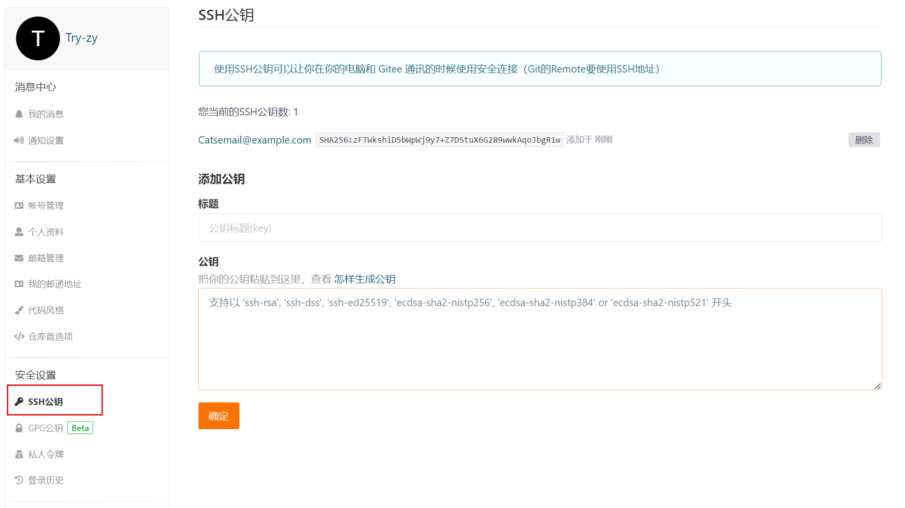

# 1.  版本控制介绍

## 1.1 版本控制

版本控制是指对软件开发过程中各种程序代码、[配置文件](https://baike.baidu.com/item/配置文件/286550?fromModule=lemma_inlink)及说明文档等文件变更的管理，是[软件配置管理](https://baike.baidu.com/item/软件配置管理/3765602?fromModule=lemma_inlink)的核心思想之一。


## 1.2 版本控制工具

集中式版本控制工具：版本库是集中存放在中央服务器的，而干活的时候，用的都是自己的电脑，所以要先从中央服务器取得最新的版本，然后开始干活，干完活了，再把自己的活推送给中央服务器。SVN。


分布式版本控制工具：分布式版本控制系统根本没有“中央服务器”，每个人的电脑上都是一个完整的版本库。Git。


版本库：版本库又名仓库，英文名**repository**，你可以简单理解成一个目录，这个目录里面的所有文件都可以被Git管理起来，每个文件的修改、删除，Git都能跟踪，以便任何时刻都可以追踪历史，或者在将来某个时刻可以“还原”。

> 注意：所有的版本控制系统，其实只能跟踪文本文件的改动，比如TXT文件，网页，所有的程序代码等等。而图片、视频这些二进制文件，虽然也能由版本控制系统管理，但没法跟踪文件的变化，只能把二进制文件每次改动串起来，也就是只知道图片从100KB改成了120KB，但到底改了啥，版本控制系统不知道。

## 1.3 Git 的优势

- 大部分操作在本地完成， 不需要联网
- 完整性保证
- 尽可能添加数据而不是删除或修改数据
- 分支操作非常快捷流畅
- 与 Linux 命令全面兼容


# 2. Git 的基本操作

## 2.1 用户名和邮箱

设置用户名和邮箱

```
$ git config --global user.name "Your Name"
$ git config --global user.email "email@example.com"
```

查看用户名和邮箱

```
$ cat ~/.gitconfig
```


## 2.2 初始化版本库

```
$ git init
Initialized empty Git repository in xxx
```


## 2.3 添加文件到版本库

把文件往Git版本库里添加的时候，是分两步执行的：

第一步是用`git add`把文件添加进去，实际上就是把文件修改添加到暂存区；

第二步是用`git commit`提交更改，实际上就是把暂存区的所有内容提交到当前分支。

1、把文件添加到仓库

```
$ git add reade.txt
```

2、把文件提交到仓库

```
$ git commit -m "wrote a reade file"
```

`-m` 后面输入的是本次提交的说明，可以输入任意内容，当然最好是有意义的

git commit 执行成功会返回： 1 file changed, 1 insertion(+)：一个文件被改动，插入了一行内容


## 2.4 查看仓库状态

`git status`告诉你有文件被修改过，用`git diff`可以查看修改内容


1、查看仓库当前的状态

```
$ git status
```

① 情况一：

```
$ git status
On branch master
Changes not staged for commit:
  (use "git add <file>..." to update what will be committed)
  (use "git restore <file>..." to discard changes in working directory)
        modified:   reade.txt

no changes added to commit (use "git add" and/or "git commit -a")
```

`git status`命令可以让我们时刻掌握仓库当前的状态，上面的命令输出告诉我们，`readme.txt`被修改过了，但还没有准备提交的修改。

② 情况二：

```
$ git status
On branch master
Changes to be committed:
  (use "git restore --staged <file>..." to unstage)
        modified:   reade.txt
```

`git status`告诉我们，将要被提交的修改包括`readme.txt`

③ 情况三：

```
$ git status
On branch master
nothing to commit, working tree clean
```

Git告诉我们当前没有需要提交的修改，而且，工作目录是干净（working tree clean）的。


2、查看具体修改了什么内容

```
$ git diff reade.txt
```

```
$ git diff reade.txt
diff --git a/reade.txt b/reade.txt
index 56b6510..699568b 100644
--- a/reade.txt
+++ b/reade.txt
@@ -1 +1,2 @@
-11111
\ No newline at end of file
+11111
+22222
\ No newline at end of file
```

`git diff`顾名思义就是查看difference，显示的格式正是Unix通用的diff格式，可以从上面的命令输出看到我们修改了什么。

用`git diff HEAD -- readme.txt`命令可以查看工作区和版本库里面最新版本的区别。


## 2.5 版本回退

1、git log 命令

`git log` 命令显示从最近到最远的提交日志。如果你不指定分支或者master，默认情况下git log显示的是目前你HEAD的位置的 git 提交日志，默认不加参数，git log 显示如下：

- commit 哈希id
- 提交的Author信息
- 提交的日期和时间
- commit info信息

```
$ git log
commit 81b486c9ecd3421ad517ec6b7a87c5966111df59 (HEAD -> master)
Author: Cat <Catsemail@example.com>
Date:   Mon Dec 26 21:00:08 2022 +0800

    33333
```

信息太多，看得眼花缭乱的，可以试试加上`--pretty=oneline`参数

```
$ git log --pretty=oneline
81b486c9ecd3421ad517ec6b7a87c5966111df59 (HEAD -> master) 33333
bd77eca3eac3c3dae086f2bcd6f04e14aa0a8dbf 22222
95d40ea9535f104e817e1975fa0115ed622a5fe9 11111
```


2、版本回退

`HEAD`指向的版本就是当前版本，因此，Git允许我们在版本的历史之间穿梭，使用命令`git reset --hard commit_id`。

```
git reset --hard HEAD
```

```
$ git reset --hard 95d40ea
HEAD is now at 95d40ea 11111
```


3、查看命令历史

要重返未来，用`git reflog`查看命令历史，以便确定要回到未来的哪个版本。

```
$ git reflog
95d40ea (HEAD -> master) HEAD@{0}: reset: moving to 95d40ea
81b486c HEAD@{1}: reset: moving to HEAD
81b486c HEAD@{2}: commit: 33333
bd77eca HEAD@{3}: commit: 22222
95d40ea (HEAD -> master) HEAD@{4}: commit (initial): 11111
```


## 2.6 撤销修改

```
$ git restore
```

**git restore --staged** <file_name> 将暂存区的修改重新放回工作区（包括对文件自身的操作，如添加文件、删除文件）

**git restore** <file_name> 丢弃工作区的修改（不包括对文件自身的操作，如添加文件、删除文件）


## 2.7 删除文件

```
git rm <file>
```

如果删除之前修改过并且已经放到暂存区域的话，则必须要用强制删除选项 **-f**。

```
git rm -f <file>
```

把文件从暂存区域移除，但仍然希望保留在当前工作目录中，换句话说，仅是从跟踪清单中删除，使用 **--cached** 选项即可

```
git rm --cached <file>
```


# 3. Git 分支管理

## 3.1 创建和切换分支

查看分支

```
$ git branch 
```

创建分支

```
$ git branch (branchname)
```

切换分支

```
$ git switch (branchname)
或
$ git checkout (branchname)
```

创建并切换分支

```
$ git switch -c (branchname)
或
$ git checkout -b (branchname)
```


## 3.2 合并分支

`git merge` 命令用于合并指定分支到当前分支。

```
$ git merge (branchname)
```

查看分支的合并情况

```
$ git log --graph --pretty=oneline --abbrev-commit
```


## 3.3 删除分支

```
git branch -d (branchname)
```


## 3.4 解决冲突

Git用`<<<<<<<`，`=======`，`>>>>>>>`标记出不同分支的内容：


## 3.5 快进合并

参考文章：https://www.shuzhiduo.com/A/gAJG967bdZ/

https://blog.csdn.net/weixin_42051619/article/details/107449425

```
       F1---F2---  feature
      /
M1---M2----------  master
```

feature分支是从master分支的M2切出来的。之后 feature 分支产生了 2 个提交，master 没有提交。

1、快进式合并

默认情况下，Git执行"快进式合并"（fast-farward merge）。

```
$ git merge feature
```

由于 master 上面没有新的提交，所以能够进行**快进**合并。

```
M1---M2---F1---F2---  master/feature
```


2、非快进式合并

```
$ git merge --no-ff feature
```

在 merge 的时候指定`--no-ff参数`，即以非快进方式进行合并。

```
       F1---F2---feature
      /       \
M1---M2--------MC---  master
```


3、总结：

git merge --no-ff 在每次合并都会产生一个新的合并记录; 

git merge 的话只有解决冲突的时候才会产生一个新的合并记录。


## 3.6 bug 分支

情景描述：当前正在dev分支上面工作，且任务没有完成，暂时无法提交，master上面有一个bug等待修复。

```
$ git stash //保存工作现场
$ git stash list //查看有哪些工作现场
```


步骤：

① 在dev分支上执行` $ git stash `保存现场；

② 用`$ git status`查看工作区，此刻工作区是干净的；

③ 切换到master分支，并在master分支上创建一个临时分支issue-101

``` 
$ git switch master
$ git branch -b issue-101
```

④ 在issue-101分支上修复bug后，进行提交，切换回master分支并进行合并

```
$ git switch master
$ git merge --no-ff -m "merged bug fix 101" issue-101
```

此时，master分支上的bug已经处理了；

⑤ 切换回dev分支，通过`$ git stash list`查看保存的分支有哪些；

```
$ git switch dev
$ git stash list
```

⑥ 恢复现场

用`git stash apply`恢复，但是恢复后，stash内容并不删除，你需要用`git stash drop`来删除；

用`git stash pop`，恢复的同时把stash内容也删了；

可以多次stash，用`$ git stash apply stash@{0}`恢复到指定stash。

⑦ dev分支是早期从master分支分出来的，所以，这个bug其实在当前dev分支上也存在。

在master分支上修复的bug，想要合并到当前dev分支，可以用`git cherry-pick <commit>`命令，把bug提交的修改“复制”到当前分支，避免重复劳动。

```
$ git cherry-pick 4c805e2
```

注意：Git自动给dev分支做了一次提交，注意这次提交的commit不同于master的commit。


## 3.7 多人协作

当你从远程仓库克隆时，实际上Git自动把本地的`master`分支和远程的`master`分支对应起来了，并且，远程仓库的默认名称是`origin`。

要查看远程库的信息，用`git remote`：

```
$ git remote
origin
```

`git remote -v`显示更详细的信息

```
$ git remote -v
origin  git@gitee.com:compiled/stunote.git (fetch)
origin  git@gitee.com:compiled/stunote.git (push)
```

 

多人协作工作模式：

1. 首先，可以试图用`git push origin <branch-name>`推送自己的修改；
2. 如果推送失败，则因为远程分支比你的本地更新，需要先用`git pull`试图合并；
3. 如果合并有冲突，则解决冲突，并在本地提交；
4. 没有冲突或者解决掉冲突后，再用`git push origin <branch-name>`推送就能成功！

如果`git pull`提示`no tracking information`，则说明本地分支和远程分支的链接关系没有创建，用命令`git branch --set-upstream-to <branch-name> origin/<branch-name>`。


# 4. 标签管理

标签tag就是一个让人容易记住的有意义的名字，它跟某个commit绑在一起。

## 创建标签

1、创建标签

```
$ git tag <tagname> //在最后一次提交上打标签
$ git tag <tagname> commitid //在指定的commitid上打标签
```

2、查看标签

```
$ git tag
```

3、创建有说明的标签

```
$ git tag -a v0.1 -m "version 0.1 released" 1094adb //-a标签名 -m说明
$ git show <tagname> //查看说明
```


## 操作标签

1、删除一个本地标签

```
git tag -d <tagname>
```

2、推送某个标签到远程

```
git push origin <tagname>
```

一次性推送全部尚未推送到远程的本地标签：

```
$ git push origin --tags
```

3、删除一个远程标签

先删除本地标签

```
git tag -d <tagname>
```

然后删除远程标签

```
git push origin :refs/tags/<tagname>
```


# 5. 远程仓库

1、创建SSH Key 

```
$ ssh-keygen -t rsa -C "youremail@example.com"
```

在用户主目录里找到`~/.ssh`目录，里面有`id_rsa`和`id_rsa.pub`两个文件，这两个就是SSH Key的秘钥对，`id_rsa`是私钥，不能泄露出去，`id_rsa.pub`是公钥，可以放心地告诉任何人。

 2、添加SSH key到远程仓库



为什么GitHub需要SSH Key呢？因为GitHub需要识别出你推送的提交确实是你推送的，而不是别人冒充的。

3、关联远程仓

```
git remote add <name> <url>
```


删除别名为<name>的远端仓库的关联关系。

```
git remote rm <name>
git remote rename <old-name> <new-name> //重命名
```

4、把本地库的所有内容推送到远程库上

```
$ git push -u origin master
```

由于远程库是空的，我们第一次推送`master`分支时，加上了`-u`参数，Git不但会把本地的`master`分支内容推送的远程新的`master`分支，还会把本地的`master`分支和远程的`master`分支关联起来。

```
$ git push origin master
```


5、删除远程库

此处的“删除”其实是解除了本地和远程的绑定关系，并不是物理上删除了远程库。

```
git remote rm <name>
```


# 如何清除所有提交记录

https://www.cnblogs.com/msxh/p/11082246.html

　　1.切换到新的分支

```
git checkout --orphan latest_branch
```

　　2.缓存所有文件（除了.gitignore中声明排除的）

```
 git add -A
```

　　3.提交跟踪过的文件（Commit the changes）

```
 git commit -am "commit message"
```

　　4.删除master分支（Delete the branch）

```
git branch -D master
```

　　5.重命名当前分支为master（Rename the current branch to master）

```
 git branch -m master
```

　　6.提交到远程master分支 （Finally, force update your repository）

```
 git push -f origin master
```


# 如何提交空文件夹

在每个空文件夹新建一个.gitignore文件

```
find . -type d -empty -exec touch {}/.gitignore \;
```

