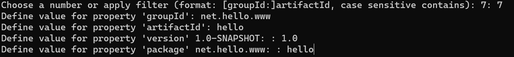

# Maven简介

Maven 是一款基于 Java 平台的项目管理和整合工具，它将项目的开发和管理过程抽象成一个**项目对象模型（POM）**。开发人员只需要做一些简单的配置，Maven 就可以自动完成项目的编译、测试、打包、发布以及部署等工作。

Maven 使用标准的目录结构和默认构建生命周期，因此开发者几乎不用花费多少时间就能够自动完成项目的基础构建工作。


**约定优于配置**

约定优于配置（Convention Over Configuration）是 Maven 最核心的涉及理念之一 ，Maven 对项目的目录结构、测试用例命名方式等内容都做了规定，凡是使用 Maven 管理的项目都必须遵守这些规则。

Maven 项目构建过程中，会自动创建默认项目结构，开发人员仅需要在相应目录结构下放置相应的文件即可。

例如，下表显示了项目源代码文件，资源文件和其他配置在 Maven 项目中的默认位置。

| 文件         | 目录               |
| ------------ | ------------------ |
| Java 源代码  | src/main/java      |
| 资源文件     | src/main/resources |
| 测试源代码   | src/test/java      |
| 测试资源文件 | src/test/resources |
| 打包输出文件 | target             |
| 编译输出文件 | target/classes     |


**安装Maven**

Apache Maven 官网：https://maven.apache.org/download.cgi

1、下载 zip 包：apache-maven-3.6.3-bin.zip。

2、配置环境变量：

- 新建系统变量 MAVEN_HOME，变量值为 Maven 的安装目录。
- 编辑系统变量 Path，添加变量值：`;%MAVEN_HOME%\bin`

3、执行 `mvn -version ` ，输出 maven 版本说明安装成功


# POM文件

POM（Project Object Model，项目对象模型）是 Maven 的基本组件，它是以 xml 文件的形式存放在项目的根目录下，名称为 pom.xml。

POM 中定义了项目的基本信息，用于描述项目如何构建、声明项目依赖等等。


**POM 示例：**

所有的 Maven 项目都有一个 POM 文件，所有的 POM 文件都必须有 project 元素和 3 个必填字段：groupId、artifactId 以及 version。

```xml
<project xmlns="http://maven.apache.org/POM/4.0.0"
         xmlns:xsi="http://www.w3.org/2001/XMLSchema-instance"
         xsi:schemaLocation="http://maven.apache.org/POM/4.0.0 https://maven.apache.org/xsd/maven-4.0.0.xsd">
    <modelVersion>4.0.0</modelVersion>
    <groupId>net.biancheng.www</groupId>
    <artifactId>maven</artifactId>
    <version>0.0.1-SNAPSHOT</version>
</project>
```

| 节点       | 描述                                                         |
| ---------- | ------------------------------------------------------------ |
| groupId    | 项目组 ID，定义当前 Maven 项目隶属的组织或公司，通常是唯一的。 |
| artifactId | 项目 ID，通常是项目的名称。groupId 和 artifactId 一起定义了项目在仓库中的位置。 |
| version    | 项目版本。                                                   |


**Super POM：**

无论 POM 文件中是否显示的声明，所有的 POM 均继承自一个父 POM，这个父 POM 被称为 Super POM，它包含了一些可以被继承的默认设置。

Maven 使用 effective pom (Super POM 的配置加上项目的配置）来执行相关任务，它替开发人员在 pom.xml 中做了一些最基本的配置。当然，开发人员依然可以根据需要重写其中的配置信息。

执行以下命令 ，就可以查看 Super POM 的默认配置。

```
mvn help:effective-pom
```

effective-pom 中包含了 Maven 在执行任务时需要用到的默认目录结构、输出目录、插件、仓库和报表目录等内容。


# 创建Maven项目

Maven 提供了大量不同类型的 Archetype 模板，通过它们可以帮助用户快速的创建 Java 项目，其中最简单的模板就是 maven-archetype-quickstart，它只需要用户提供项目最基本的信息，就能生成项目的基本结构及 POM 文件。


**使用 maven-archetype-quickstart 原型快速创建一个简单的 Maven 项目**

在 D:\MavenProject 下执行

```shell
mvn archetype:generate -DgroupId=net.itcast.www -DartifactId=helloMaven -DarchetypeArtifactId=maven-archetype-quickstart -DinteractiveMode=false
```

- -DgroupId: 项目组 ID，通常为组织名或公司网址的反写。
- -DartifactId: 项目名。
- -DarchetypeArtifactId: 指定 ArchetypeId，maven-archetype-quickstart 用于快速创建一个简单的 Maven 项目。
- -DinteractiveMode: 是否使用交互模式。


**构建和测试项目**

Maven 会在项目中自动生成了一个源码文件 App.java 和一个测试文件 AppTest.java 。

在 D:\MavenProject\helloMaven 下执行

```shell
mvn clean package
```


说明：

Maven 命令中包含了两个命令

- clean 负责清理 target 目录
- ackage 负责将项目构建并打包输出为 jar 文件。

项目构建完成后，在该项目根目录中生成了一个名为 target 的目录

- classes：源代码编译后存放在该目录中。
- test-classes：测试源代码编译后并存放在该目录中。
- surefire-reports：Maven 运行测试用例生成的测试报告存放在该目录中。
- helloMaven-1.0-SNAPSHOT.jar：Maven 对项目进行打包生成的 jar 文件。


# Maven坐标

在 Maven 中，任何一个依赖、插件或者项目构建的输出，都可以称为构件。

世界上任何一个构件都可以使用 Maven 坐标并作为其唯一标识，Maven 坐标包括 groupId、artifactId、version、packaging 等元素，只要用户提供了正确的坐标元素，Maven 就能找到对应的构件。 

```xml
<project> 
    <groupId>项目组 ID，定义当前 Maven 项目隶属的组织或公司，通常是唯一的。</groupId>
    <artifactId>项目 ID，通常是项目的名称。</artifactId>
    <packaging>项目的打包方式，默认值为 jar。</packaging>
    <version>版本号</version>
</project>
```

任何一个构件都必须明确定义自己的坐标，这是 Maven 的强制要求，任何构件都不能例外。


# **Maven依赖**

通俗的说，如果一个 Maven 构建所产生的构件（例如 Jar 文件）被其他项目引用，那么该构件就是其他项目的依赖。

Maven 坐标是依赖的前提，所有 Maven 项目必须明确定义自己的坐标。


**依赖声明**

```xml
<dependencies>
    
    <dependency>
        <groupId>javax.servlet</groupId>
        <artifactId>servlet-api</artifactId>
        <version>2.5</version>
        <scope>provided</scope>
    </dependency>
    
    <dependency>
    ...
    </dependency>
    
</dependencies>
```

标签说明：

- groupId、artifactId 和 version：依赖的基本坐标，对于任何一个依赖来说，基本坐标是最重要的，Maven 根据坐标才能找到需要的依赖。
- type：依赖的类型，对应于项目坐标定义的 packaging。大部分情况下，该元素不必声明，其默认值是 jar。
- scope：依赖的范围。
- optional：标记依赖是否可选。
- exclusions：用来排除传递性依赖。


**获取依赖坐标**

mvn仓库：https://mvnrepository.com/ 


# Maven仓库

Maven 仓库可以分为 2 个大类：

- 本地仓库
- 远程仓库


当 Maven 根据坐标寻找构件时，它会首先查看本地仓库，若本地仓库存在此构件，则直接使用；若本地仓库不存在此构件，Maven 就会去远程仓库查找，若发现所需的构件后，则下载到本地仓库使用。如果本地仓库和远程仓库都没有所需的构件，则 Maven 就会报错。


**本地仓库**

Maven 本地仓库实际上就是本地计算机上的一个目录（文件夹），它会在第一次执行 Maven 命令时被创建。

在 settings.xml 中修改本地仓库地址：

```xml
<localRepository>D:/myRepository/repository</localRepository>
```


**中央仓库**

Maven 社区的 URL：http://search.maven.org/#browse


# **Maven生命周期**

Maven 从大量项目和构建工具中学习和反思，最后总结了一套高度完美的，易扩展的生命周期。这个生命周期将项目的清理、初始化、编译、测试、打包、集成测试、验证、部署和站点生成等几乎所有构建过程进行了抽象和统一。


**生命周期与插件的关系**

Maven 生命周期是抽象的，其本身不能做任何实际工作，这些实际工作（如源代码编译）都通过调用 [Maven 插件](http://c.biancheng.net/maven2/plugin.html) 中的插件目标（plugin goal）完成的。

生命周期抽象了构建的各个步骤，定义了它们的执行顺序，但却没有提供具体的实现。插件中完成了对构建过程的实现，想要完成某个构建步骤，调用插件中的一个或多个插件目标即可。

类比：将 Maven 生命周期理解成一个抽象父类，将插件理解成其子类，将插件目标理解成子类中重写的方法。


## **三套生命周期**

Maven 拥有三套标准的生命周期：

- clean：用于清理项目
- default：用于构建项目
- site：用于建立项目站点


**构建阶段**

每套生命周期包含一系列的构建阶段（phase），这些阶段是有顺序的，且**后面的阶段依赖于前面的阶段**。用户与 Maven 最直接的交互方式就是调用这些生命周期阶段。

<font color='red'>通过将阶段名传递给 mvn 命令，就可以调用构建阶段。</font>


**生命周期的独立性**

与构建阶段的前后依赖关系不同，三套生命周期本身是相互独立的，用户可以只调用 clean 生命周期的某个阶段，也可以只调用 default 生命周期的某个阶段，而不会对其他生命周期造成任何影响。 


## **clean生命周期**

 clean 生命周期包括以下 3 个阶段。

- pre-clean（清理前）
- clean（清理）
- post-clean（清理后）


## **default生命周期**

| 阶段                  | 描述                                                         |
| --------------------- | ------------------------------------------------------------ |
| validate              | 验证项目是否正确以及所有必要信息是否可用。                   |
| initialize            | 初始化构建状态。                                             |
| generate-sources      | 生成编译阶段需要的所有源码文件。                             |
| process-sources       | 处理源码文件，例如过滤某些值。                               |
| generate-resources    | 生成项目打包阶段需要的资源文件。                             |
| process-resources     | 处理资源文件，并复制到输出目录，为打包阶段做准备。           |
| compile               | 编译源代码，并移动到输出目录。                               |
| process-classes       | 处理编译生成的字节码文件                                     |
| generate-test-sources | 生成编译阶段需要的测试源代码。                               |
| process-test-sources  | 处理测试资源，并复制到测试输出目录。                         |
| test-compile          | 编译测试源代码并移动到测试输出目录中。                       |
| test                  | 使用适当的单元测试框架（例如 JUnit）运行测试。               |
| prepare-package       | 在真正打包之前，执行一些必要的操作。                         |
| package               | 获取编译后的代码，并按照可发布的格式进行打包，例如 JAR、WAR 或者 EAR 文件。 |
| pre-integration-test  | 在集成测试执行之前，执行所需的操作，例如设置环境变量。       |
| integration-test      | 处理和部署所需的包到集成测试能够运行的环境中。               |
| post-integration-test | 在集成测试被执行后执行必要的操作，例如清理环境。             |
| verify                | 对集成测试的结果进行检查，以保证质量达标。                   |
| install               | 安装打包的项目到本地仓库，以供其他项目使用。                 |
| deploy                | 拷贝最终的包文件到远程仓库中，以共享给其他开发人员和项目。   |


## site 生命周期

sit 生命周期的目的是建立和部署项目站点，Maven 能够根据 POM 包含的信息，自动生成一个友好的站点，该站点包含一些与该项目相关的文档。

site 生命周期包含以下 4 个阶段：

- pre-site
- site
- post-site
- site-deploy


# 导入本地jar包

```xml
<!--外部依赖-->
<dependency>
    <groupId>net.biancheng.www</groupId>
    <artifactId>helloMaven</artifactId>
    <!--依赖范围-->
    <scope>system</scope>
    <version>1.0-SNAPSHOT</version>
    <!--依赖所在位置-->
    <systemPath>D:\maven\helloMaven\target\helloMaven-1.0-SNAPSHOT.jar</systemPath>
</dependency>
```

在以上配置中，除了依赖的坐标信息外，外部依赖还使用了 scope 和 systemPath 两个元素。

- scope 表示依赖范围，这里取值必须是 system，即系统。
- systemPath 表示依赖的本地构件的位置。


# Maven site(站点)

POM 中可以包含各种项目信息，例如：项目描述、SCM 地址、许可证信息，开发者信息等。用户可以使用 Maven 提供的 maven-site-plugin 插件让 Maven 生成一个 Web 站点， 以站点的形式发布以上信息。

```xml
<build>
    <plugins>
        <!--添加site 插件-->
        <plugin>
            <groupId>org.apache.maven.plugins</groupId>
            <artifactId>maven-site-plugin</artifactId>
            <version>3.7.1</version>
        </plugin>
    </plugins>
</build>
```


打开命令行窗口，跳转到项目所在的目录中，执行如下 mvn 命令。

```
mvn site
```


# Maven Archetype

Archetype(原型/模板)

Archetype 是 Maven 项目的模板工具包，它定义了 Maven 项目的基本架构。Archetype 为开发人员提供了数千种创建 Maven 项目的模板，Maven 通过这些模板可以帮助用户快速的生成项目的目录结构以及 POM 文件。

Maven Archetype 由下面 5 个模块组成：

- maven-archetype-plugin：Archetype 插件。
- archetype-packaging：用于描述 Archetype 的生命周期与构建项目软件包。
- archetype-models：用于描述类与引用。
- archetype-common：核心类。
- archetype-testing：用于测试 Maven Archetype 的内部组件。


**maven-archetype-plugin**

Maven 的所有功能都是通过插件实现的，Archetype 也不例外，它是由一个名为 maven-archetype-plugin 的插件实现的，该插件提供了 ArcheType 的所有功能。

执行以下命令可以帮助用户快速的创建 Maven 项目.

```
mvn archetype:generate
```




# SNAPSHOT(快照)

SNAPSHOT（快照）是一种特殊的版本，它表示当前开发进度的副本。与常规版本不同，快照版本的构件在发布时，Maven 会自动为它打上一个时间戳，有了这个时间戳后，当依赖该构件的项目进行构建时，Maven 就能从仓库中找到最新的 SNAPSHOT 版本文件。

定义一个组件或模块为快照版本，只需要在其 pom.xml 中版本号（version 元素的值）后加上 -SNAPSHOT 即可，例如：

```xml
<groupId>net.hello.com</groupId>
<artifactId>hello</artifactId>
<packaging>jar</packaging>
<version>1.0-SNAPSHOT</version>
```


**SNAPSHOT 版本 VS RELEASE 版本** 

Maven 仓库分为两种，Snapshot 快照仓库和 Release 发行仓库。Snapshot 快照仓库用于保存开发过程中的不稳定 SNAPSHOT 版本，Release 发行仓库则用来保存稳定的 RELEASE 版本。

Maven 会根据模块的版本号（pom.xml 文件中的 version 元素）中是否带有 -SNAPSHOT 来判断是 SNAPSHOT 版本还是正式 RELEASE 版本。带有 -SNAPSHOT 是SNAPSHOT（快照）版本，不带 -SNAPSHOT 的就是正式 RELEASE（发布）版本。

| 区别                       | SNAPSHOT 版本                                                | RELEASE 版本                                                 |
| -------------------------- | ------------------------------------------------------------ | ------------------------------------------------------------ |
| 定义                       | 版本号中带有 -SNAPSHOT                                       | 版本号中不带有 -SNAPSHOT                                     |
| 发布仓库                   | Snapshot 快照仓库                                            | Release 发行仓库                                             |
| 是否从远程仓库自动获取更新 | 在不更改版本号的前提下，直接编译打包时，Maven 会自动从远程仓库上下载最新的快照版本。 | 在不更改版本号的前提下，直接编译打包时，如果本地仓库已经存在该版本的模块，则 Maven 不会主动去远程仓库下载。 |
| 稳定性                     | 快照版本往往对应了大量带有时间戳的构件，具有不稳定性。       | 发布版本只对应了唯一的构件，具有稳定性。                     |
| 使用场景                   | 快照版本只应该在组织内部的项目中依赖使用。                   | Maven 项目使用的组织外的依赖项都应该时发布版本的，不应该使用任何的快照版本依赖，否则会造成潜在的风险。 |
| 发布前是否需要修改         | 当项目经过完善的测试后，需要上线时，应该将项目从快照版本更改为发布版本 | 不需要修改                                                   |


# 自动化构建

Maven 自动化构建是一种方案，即当某个项目构建完成后（特别是有代码更新的情况下），所有依赖它的相关项目也应该开始构建过程，以确保这些项目的稳定运行。

Maven 的自动化构建主要通过如下两种方案实现：

- 使用 maven-invoker-plugin 插件。
- 使用持续集成（CI）服务器自动管理构建自动化

```xml
 <!-- 添加invoker 插件 -->
<plugin>
    <groupId>org.apache.maven.plugins</groupId>
    <artifactId>maven-invoker-plugin</artifactId>
    <version>3.2.2</version>
    <configuration>
        <debug>true</debug>
        <!--设置 invkoer插件 添加的 pom 文件所在的文件夹  -->
        <projectsDirectory>D:\maven</projectsDirectory>
        <!-- 设置 invkoer插件 添加的 pom 文件 -->
        <pomIncludes>
            <pomInclude>secondMaven\pom.xml</pomInclude>
            <pomInclude>thirdMaven\pom.xml</pomInclude>
        </pomIncludes>
    </configuration>
    <executions>
        <execution>
            <id>id-integration-test</id>
            <!-- 执行的目标 -->
            <goals>
                <goal>run</goal>
            </goals>
        </execution>
    </executions>
</plugin>
```

以上配置中，在 build 的 plugins 子元素中使用了一个 plugin 元素声明了一个构建期的插件 maven-invoker-plugin，该插件配置中各元素含义如下：

- groupId：插件的项目组 id;
- artifactId：插件的项目或模块 id；
- version：插件的版本；
- projectsDirectory：需要构建项目的目录，该元素可单独使用，表示该目录下的所有 Maven 项目都会在当前项目构建完成后开始构建；
- pomIncludes：该元素内可以声明一个或多个 pomInclude 元素，需与 projectDirectory 元素配合使用，共同指定需要构建项目的 pom.xml。


# 依赖传递

Maven 的依赖传递机制是指：不管 Maven 项目存在多少间接依赖，POM 中都只需要定义其直接依赖，不必定义任何间接依赖，Maven 会动读取当前项目各个直接依赖的 POM，将那些必要的间接依赖以传递性依赖的形式引入到当前项目中。

**依赖范围**

通俗的讲，就是控制 Jar 包在哪些范围被加载和使用。

scope元素的作用：控制 dependency 元素的使用范围。

首先，我们要知道 Maven 在对项目进行编译、测试和运行时，会分别使用三套不同的 classpath。Maven 项目构建时，在不同阶段引入到 classpath 中的依赖是不同的。

我们可以在 POM 的依赖声明使用 scope 元素来控制依赖与三种 classpath（编译 classpath、测试 classpath、运行 classpath ）之间的关系，这就是依赖范围。

```xml
<dependency>
    <groupId>javax.servlet</groupId>
    <artifactId>servlet-api</artifactId>
    <version>3.0-alpha-1</version>
    <scope>provided</scope>
</dependency>
```

详细参考：https://blog.csdn.net/weixin_40017062/article/details/122711341


**依赖调节**

因为有依赖传递的存在，就会导致jar包在依赖的过程中出现冲突问题。

- 特殊优先：当同级配置了相同资源的不同版本，后配置的覆盖先配置的。
- 引入路径短者优先：当一个间接依赖存在多条引入路径时，引入路径短的会被解析使用。
- 先声明者优先：引入路径长度相同的前提下，POM 文件中依赖声明的顺序决定了间接依赖会不会被解析使用，顺序靠前的优先使用。


# 排除依赖和可选依赖

## 排除依赖

​	假设存在这样的依赖关系，A 依赖于 B，B 依赖于 X，B 又依赖于 Y。B 实现了两个特性，其中一个特性依赖于 X，另一个特性依赖于 Y，且两个特性是互斥的关系，用户无法同时使用两个特性，所以 A 需要排除 X。

排除依赖是通过在 A 中使用 exclusions 元素实现的。

```xml
<modelVersion>4.0.0</modelVersion>
<groupId>net.biancheng.www</groupId>
<artifactId>A</artifactId>
<version>1.0-SNAPSHOT</version>

<dependencies>
    <dependency>
        <groupId>net.biancheng.www</groupId>
        <artifactId>B</artifactId>
        <version>1.0-SNAPSHOT</version>
        <exclusions>
            <!-- 设置排除 -->
            <!-- 排除依赖必须基于直接依赖中的间接依赖设置为可以依赖为 false -->
            <!-- 设置当前依赖中是否使用间接依赖 -->
            <exclusion>
                <!--设置具体排除-->
                <groupId>net.biancheng.www</groupId>
                <artifactId>X</artifactId>
            </exclusion>
        </exclusions>
    </dependency>
</dependencies>
```

关于 exclusions 元素及排除依赖说明如下：

- 排除依赖是控制当前项目是否使用其直接依赖传递下来的接间依赖；
- exclusions 元素下可以包含若干个 exclusion 子元素，用于排除若干个间接依赖；
- exclusion 元素用来设置具体排除的间接依赖，该元素包含两个子元素：groupId 和 artifactId，用来确定需要排除的间接依赖的坐标信息；
- exclusion 元素中只需要设置 groupId 和 artifactId 就可以确定需要排除的依赖，无需指定版本 version。


## 可选依赖

在 B 的 POM 关于 X 的依赖声明中使用 optional 元素，将其设置成可选依赖

```xml
<project xmlns="http://maven.apache.org/POM/4.0.0"
         xmlns:xsi="http://www.w3.org/2001/XMLSchema-instance"
         xsi:schemaLocation="http://maven.apache.org/POM/4.0.0 http://maven.apache.org/maven-v4_0_0.xsd">
    <modelVersion>4.0.0</modelVersion>
    <groupId>net.biancheng.www</groupId>
    <artifactId>B</artifactId>
    <packaging>jar</packaging>
    <version>1.0-SNAPSHOT</version>
    <dependencies>
        <dependency>
            <groupId>net.biancheng.www</groupId>
            <artifactId>X</artifactId>
            <version>1.0-SNAPSHOT</version>
            <!--设置可选依赖  -->
            <optional>true</optional>
        </dependency>
    </dependencies>
</project>
```

关于 optional 元素及可选依赖说明如下：

- 可选依赖用来控制当前依赖是否向下传递成为间接依赖；
- optional 默认值为 false，表示可以向下传递称为间接依赖；
- 若 optional 元素取值为 true，则表示当前依赖不能向下传递成为间接依赖。


**排除依赖 VS 可选依赖** 

排除依赖和可选依赖都能在项目中将间接依赖排除在外，但两者实现机制却完全不一样。

- 排除依赖是控制当前项目是否使用其直接依赖传递下来的接间依赖；
- 可选依赖是控制当前项目的依赖是否向下传递；
- 可选依赖的优先级高于排除依赖；
- 若对于同一个间接依赖同时使用排除依赖和可选依赖进行设置，那么可选依赖的取值必须为 false，否则排除依赖无法生效。


# Maven继承

​	当一个项目包含多个模块时，可以在该项目中再创建一个父模块，并在其 POM 中声明依赖，其他模块的 POM 可通过继承父模块的 POM 来获得对相关依赖的声明。对于父模块而言，其目的是为了消除子模块 POM 中的重复配置，其中不包含有任何实际代码，因此父模块 POM 的打包类型（packaging）必须是 pom。

```xml
<parent>
    <groupId>net.biancheng.www</groupId>
    <artifactId>Root</artifactId>
    <version>1.0</version>
    <relativePath>../Root</relativePath>
</parent>
```

| 元素         | 描述                                                         | 是否必需 |
| ------------ | ------------------------------------------------------------ | -------- |
| groupId      | 父模块的项目组 id。                                          | 是       |
| artifactId   | 父模块 id。                                                  | 是       |
| version      | 父模块版本。                                                 | 是       |
| relativePath | 父模块 POM 的相对路径，默认值为 ../pom.xml。 项目构建时，Maven 会先根据 relativePath 查找父模块 POM，如果找不到，再从本地仓库或远程仓库中查找。 | 否       |

​	子模块的 POM 中，当前模块的 groupId 和 version 元素可以省略，但这并不意味着当前模块没有 groupId 和 version，子模块会隐式的从父模块中继承这两个元素，即由父模块控制子模块的公司组织 id 以及版本，这样可以简化 POM 的配置。


查看该模块依赖列表：

```
mvn dependency:list
```


# 依赖管理

​	子模块可以通过继承获得父模块中声明的全部依赖，这样虽然避免了在各个子模块 POM 中重复进行依赖声明，但也极有可能造成子模块中引入一些不必要的依赖。

dependencyManagement 标签用于控制子模块的依赖版本等信息。该标签只用来控制版本，不能将依赖引入。


**父 pom**

```xml
<project ...>
    <modelVersion>4.0.0</modelVersion>
    <groupId>net.biancheng.www</groupId>
    <artifactId>Root</artifactId>
    <version>1.0</version>
    <!--定义的父类pom.xml 打包类型使pom -->
    <packaging>pom</packaging>
    <properties>
        <!-- 定义一些 maven 变量 -->
        <project.build.sourceEncoding>UTF-8</project.build.sourceEncoding>
        <junit.version>4.9</junit.version>
        <mysql.connector.version>5.1.18</mysql.connector.version>
    </properties>
    <!--dependencyManagement 标签用于控制子模块的依赖版本等信息 -->
    <!-- 该标签只用来控制版本，不能将依赖引入 -->
    <dependencyManagement>
        <dependencies>
            <dependency>
                <groupId>junit</groupId>
                <artifactId>junit</artifactId>
                <!--引用的properties标签中定义的变量 -->
                <version>${junit.version}</version>
                <!-- <scope>test</scope> -->
            </dependency>
            <dependency>
                <groupId>mysql</groupId>
                <artifactId>mysql-connector-java</artifactId>
                <!--引用的properties标签中定义的变量 -->
                <version>${mysql.connector.version}</version>
                <scope>runtime</scope>
            </dependency>
        </dependencies>
    </dependencyManagement>
</project>
```


**子 pom**

```xml
<parent>
    <groupId>net.biancheng.www</groupId>
    <artifactId>Root</artifactId>
    <version>1.0</version>
    <relativePath>../Root</relativePath>
</parent>
<dependencies>
    <dependency>
        <groupId>mysql</groupId>
        <artifactId>mysql-connector-java</artifactId>
    </dependency>
</dependencies>
```


**优点：**

- 在父模块中使用 dependencyManagement 声明依赖能够统一项目内依赖的版本，子模块无须声明版本，也就不会出现多个子模块使用同一依赖项版本不一致的情况，降低依赖冲突的几率。
- dependencyManagement 声明的依赖不会被实际引入，子模块需要什么依赖就自己引入，增加了灵活性，避免引入一些不必要的依赖。


# 插件管理


```xml
<!--父 POM-->
<pluginManagement>
    <plugins>
        <!--声明插件-->
        <plugin>
            <groupId>org.apache.maven.plugins</groupId>
            <artifactId>maven-source-plugin</artifactId>
            <version>3.2.1</version>
            <executions>
                <!--将 jar-no-fork 目标绑定到 verify 阶段-->
                <execution>
                    <id>www.biancheng.net</id>
                    <phase>verify</phase>
                    <goals>
                        <goal>
                            jar-no-fork
                        </goal>
                    </goals>
                </execution>
            </executions>
        </plugin>
    </plugins>
</pluginManagement>
```

```xml
<!--子 POM-->
<plugins>
    <plugin>
        <groupId>org.apache.maven.plugins</groupId>
        <artifactId>maven-source-plugin</artifactId>
    </plugin>
</plugins>
```


# Maven聚合

​	在实际的开发过程中，我们所接触的项目一般都由多个模块组成。在构建项目时，如果每次都按模块一个一个地进行构建会十分得麻烦，Maven 的聚合功能很好的解决了这个问题。

​	与父模块相似，聚合模块的打包方式（packaging）也是 pom，用户可以在其 POM 中通过 modules 下的 module 子元素来添加需要聚合的模块的目录路径。

```xml
<project ...>
    <modelVersion>4.0.0</modelVersion>
    <groupId>net.biancheng.www</groupId>
    <artifactId>Root</artifactId>
    <version>1.0</version>
    <!--定义的父类pom.xml 打包类型使pom -->
    <packaging>pom</packaging>
    <properties>
        <!-- 定义一些属性 -->
        <project.build.sourceEncoding>UTF-8</project.build.sourceEncoding>
		...
    </properties>

    <!--dependencyManagement 标签用于控制子模块的依赖版本等信息 -->
    <!-- 该标签只用来控制版本，不能将依赖引入 -->
    <dependencyManagement>
        <dependencies>
		...
        </dependencies>
    </dependencyManagement>

    <!--添加需要聚合的模块-->
    <modules>
        <module>../App-Core-lib</module>
        <module>../App-Data-lib</module>
    </modules>
</project>
```


**区别继承和聚合**

- Maven 的继承和聚合的目的不同，继承的目的是为了消除 POM 中的重复配置，聚合的目的是为了方便快速的构建项目。

- 对于继承中的父模块来说，它跟本不知道那些模块继承了它，但子模块都知道自己的父模块是谁。

- 对于聚合模块来说，它知道哪些模块被聚合了，但那些被聚合的模块根本不知道聚合模块的存在。


# Maven Profile

一个项目通常都会有多个不同的运行环境，例如开发环境，测试环境、生产环境等。而不同环境的构建过程很可能是不同的，例如数据源配置、插件、以及依赖的版本等。每次将项目部署到不同的环境时，都需要修改相应的配置，这样重复的工作，不仅浪费劳动力，还容易出错。为了解决这一问题，Maven 引入了 Profile 的概念，通过它可以为不同的环境定制不同的构建过程。


# Maven 自动化部署

C语言中文网：http://c.biancheng.net/maven2/auto-deploy.html
