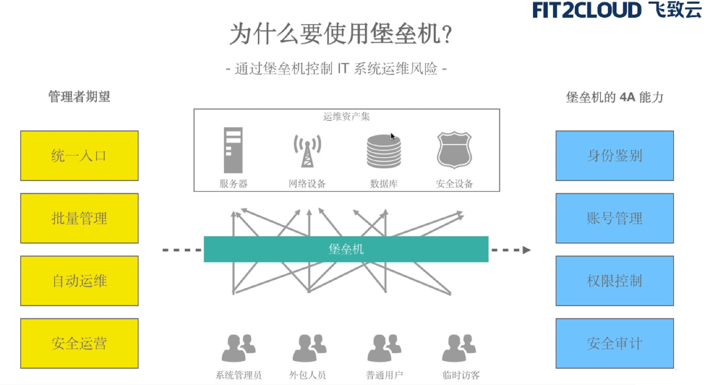

# 跳板机和堡垒机

## 堡垒机架构图

近年来数据安全事故频发，包括斯诺登事件、希拉里邮件丑闻以及携程宕机事件等数据安全与防止泄露成为政府和企业都非常关心的议题，因此堡垒机也应运而生

## 跳板机

### 什么是跳板机

跳板机就是一台服务器，运维人员在维护过程中首先要统一登录到这台服务器，然后再登录到目标设备进行维护和操作;

在腾讯，跳板机是开发者登录到服务器的唯一途径，开发者必须先登录跳板机，再通过跳板机登录到应用服务器。

跳板机属于内控堡垒机范畴，是一种用于单点登陆的主机应用系统。跳板机就是一台服务器，维护人员在维护过程中，首先要统一登录到这台服务器上，然后从这台服务器再登录到目标设备进行维护。但跳板机并没有实现对运维人员操作行为的控制和审计，此外，跳板机存在严重的安全风险，一旦跳板机系统被攻入，则将后端资源风险完全暴露无遗。

### 跳板机的优缺点

优势：集中式进行管理

缺点：没有实现对运维人员操作行为的控制和审计，使用跳板机的过程中还是会出现误操作，违规操作等导致的事故，一旦出现操作事故很难定位到原因和责任人。

## 堡垒机

### 运维思想

审计是事后行为，可以发现问题及责任人，但是无法防止问题发生。

只有事先严格控制，才能从源头解决根本问题。

系统账号的作用只是区分工作角色，但是无法确认该执行人的身份。

### 什么是堡垒机

堡垒机的理念起源于跳板机。人们逐渐认识到跳板机的不足，需要更新、更好的安全技术理念来实现运维操作管理，需要一种能满足角色管理与授权审批、信息资源访问控制、操作记录和审计、统变更和维护控制要求，并生成一些统计报表配合管理规范来不断提升IT内控的合规性的产品。

堡垒机即在一个特定的网络环境下，为了保障网络和数据不受来自外部和内部用户的入侵和破坏，而运用各种技术手段监控和记录运维人员对网络内的服务器、网络设备、安全设备、数据库等设备的操作行为，以便集中报警、及时处理及审计定责。

其从功能上讲，它综合了核心系统运维和安全审计管控两大主干功能，从技术实现上讲，通过切断终端计算机对网络和服务器资源的直接访问，而采用协议代理的方式，接管了终端计算机对网络和服务器的访问。形象地说，终端计算机对目标的访问，均需要经过运维安全审计的翻译。打一个比方，运维安全审计扮演着看门者的工作，所有对网络设备和服务器的请求都要从这扇大门经过。

### 堡垒机的作用

1) 核心系统运维和安全审计管控:
2) 过滤和拦截非法访问、恶意攻击，阻断不合法命令，审计监控、报警、责任追踪
3) 报警、记录、分析、处理;

### 堡垒机的核心功能

1. 单点登录功能

   支持对X11、Linux、Unix、数据库、网络设备、安全设备等一系列授权账号进行密码的自动化周期更改，简化密码管理，让使用者无需记忆众多系统密码，即可实现自动登录目标设备，便捷安全；

2. 账号管理

   设备支持统一账户管理策略，能够实现对所有服务器、网路设备、安全设备等账号进行集中管理，完成对账号整个生命周期的监控，并且可以对设备进行特殊角设置，如: 审计巡检员、运维操作员设备管理员等自定义，以满足审计需求；

3. 身份认证

   设备提供统一的认证接口，对用户进行认证，支持身份认证模式包括动态口令、静态密码、硬件key、生物特征等多种认证方式，设备具有灵活的定制接口，可以与其他第三方认证服务器直接结合；

4. 资源授权

   设备提供基于用户、目标设备、时间、协议类型IP、行为等要素实现细粒度的操作授权，最大限度保护用户资源的安全；

5. 访问控制

   设备支持对不同用户进行不同策略的制定，细粒度的访问控制能够最大限度的保护用户资源的安全，严防非法、越权访问事件的发生；

6. 操作审计

   设备能够对字符串、图形、文件传输、数据库等安全操作进行行为审计;通过设备录像方式监控运维人员对操作系统、安全设备、网络设备、数据库等进行的各种操作.对违规行为进行事中控制;对终端指令信息能够进行精确搜索，进行录像精确定位。

