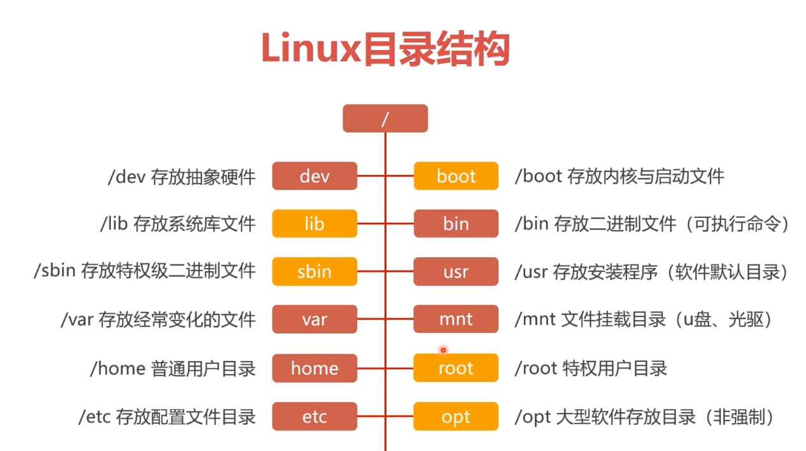

[TOC]

参考网站：https://www.cnblogs.com/authorware/category/1907640.html


# 基础篇

## 第1章 Linux 开山篇-内容介绍

- **本套 Linux 课程内容**
  
  

> Linux 主要应用领域：服务器


## 第2章 Linux 基础篇-Linux 入门

- **Linux 之父**

> Linus Torvalds
> Git 创作者
> Linux 0.01版作者，代码不到一万行

- **Linux 主要发行版**

> Ubuntu, RedHat, CentOS, Debain, Fedora

- **Unix 与 Linux 的关系**
  

> Linux内核：Linux（全称GNU/Linux）由Linus于1991年8月发布，是一种免费使用和自由传播的<font color='red'>类UNIX操作系统</font>。它具有现代成熟Unix中所期望的所有功能，包括真正的多任务处理、虚拟内存、共享库、按需加载、共享写时拷贝可执行文件、适当的内存管理以及包括IPv4和IPv6在内的多级网络。


## 第3章 Linux 基础篇-VMare 和 CentOS 的安装

> VMare 15.5 安装包：https://www.nocmd.com/windows/740.html
> CentOS 7.6 DVD版：https://mirrors.aliyun.com/centos-vault/7.6.1810/isos/x86_64/
> CentOS 8.1 DVD版：https://mirrors.aliyun.com/centos-vault/8.1.1911/isos/x86_64/

- **安装 CentOS 时，设置软件选择**

> - 基本环境：GNOME 桌面
> - 附加选项：传统 X Windows 系统兼容性、兼容性程序库、开发工具

- **安装 CentOS 时，设置自助分区（共20G）**

> - boot：引导分区，分配大小为1G。
> - swap：交换分区，分配大小和实际内存一致即可，此处为2G。
>   临时充当内存，操作系统对于内存不足的补充机制，速度不如内存。
> - 根分区：分配大小为剩下的17G。安装的软件和文件都在此分区。

- **虚拟机的网络连接模式**

> - 桥接模式：虚拟系统可以和外部系统通讯，虚拟机IP和主机IP处在同一字段。
>   若同一网络下有较多计算机接入时，容易造成IP冲突。
> - NAT模式：网络地址转换模式。虚拟系统可以和外部系统通讯。
>   通过主机代理上网，虚拟机IP和主机IP不在同一字段。
>   主机产生虚拟网卡，该虚拟网卡和虚拟机IP在同一字段。若同一网络下有较多计算机接入时，不会造成IP冲突。
> - 主机模式：独立的系统，虚拟系统不可以和外部系统通讯。

```shell
# 网络配置
[root@localhost ~]# cat /etc/sysconfig/network-scripts/ifcfg-ens33 
TYPE="Ethernet"
PROXY_METHOD="none"
BROWSER_ONLY="no"
BOOTPROTO="none"
DEFROUTE="yes"
IPV4_FAILURE_FATAL="no"
IPV6INIT="yes"
IPV6_AUTOCONF="yes"
IPV6_DEFROUTE="yes"
IPV6_FAILURE_FATAL="no"
IPV6_ADDR_GEN_MODE="stable-privacy"
NAME="ens33"
UUID="661f6c8a-061c-4b4c-b21d-c7f435dda0e1"
DEVICE="ens33"
ONBOOT="yes"
IPADDR="192.168.126.110"
PREFIX="24"
GATEWAY="192.168.126.2"
DNS1="192.168.126.2"
IPV6_PRIVACY="no"

# 关闭防火墙
systemctl stop NetworkManager
systemctl disable NetworkManager
```


- **虚拟机的克隆**

> 如果已经安装了一台 Linux 操作系统，还想要更多的，没有必要再重新安装，只需要克隆就可以。
>
> - 方式一：直接拷贝一份安装好的文件；
> - 方式二：使用 VMware 的克隆操作。注意，克隆时，需要先关闭要克隆的 Linux 系统。

- **虚拟机的快照**

> 如果在使用虚拟机系统的时候（比如 Linux 系统），想回到原先的一个状态，也就是说担心有些误操作造成系统异常，需要回到原先某个正常运行的状态。VMware 也提供了这样的功能，就叫快照管理。

- **虚拟机的迁移和删除**

> 虚拟系统安装好了，它的本质就是文件（放在文件夹的），因此虚拟系统的迁移很方便，你可以把安装好的虚拟系统这个文件夹整体拷贝或者剪切到另外的位置使用。删除也很简单，用 VMware 进行移除，再点击菜单->从磁盘删除即可，或者直接手动删除虚拟系统对应的文件夹即可。

- **安装 VMware Tools**

> - 安装 VMware Tools 后，可以在 Windows 下更好的管理 VMware 虚拟机
> - 可以设置 Windows 和 CentOS 的共享文件夹


## 第4章 Linux 基础篇-目录结构

- **Linux 目录结构**

> 
>
> Linux 系统的文件结构是采用级层式的树状目录结构，在 Linux 世界里，一切皆文件。Linux 系统里的硬件也转换成了文件的形式。
>
> - /bin：是 Binary 的缩写，这个目录存放着是最常使用的命令。
> - /boot：这⾥存放的是启动Linux时使⽤的⼀些核⼼⽂件，包括⼀些连接⽂件以及镜像⽂件。
> - /dev ：dev是Device(设备)的缩写, 该⽬录下存放的是Linux的外部设备，在Linux中访问设备的⽅式和访问⽂件的⽅式是相同的。
> - /home： 存放普通用户的主目录。
> - /root： 该目录为系统管理员，也称作超级权限者的用户主目录。
> - /etc： 所有系统管理需要的配置文件和子目录。
> - /usr：一个非常重要的目录，用户的许多应用程序和文件都放在这个目录下。类似于indows下的program files⽬录。  
> - /proc： 是一个虚拟的目录，它是系统内存的映射。访问这个目录来获取系统信息。
> - /media：Linux 系统会自动识别一些设备，例如U盘、光驱等等。当识别后，Linux系统会把识别的设备挂载到这个目录下。
> - /mnt：系统提供该目录是为了让用户临时挂载别的文件系统，可以将外部的储存挂载到 /mnt 上，如 Windows 和 Linux 的共享文件夹。
> - /lib：这个⽬录⾥存放着系统最基本的动态连接共享库，其作⽤类似于Windows⾥的DLL⽂件。⼏乎所有的应⽤程序都需要⽤到这些共享库。 


**目录挂载**

> 挂载通常是将⼀个 `存储设备` 挂接到⼀个已经存在的`⽬录` 上，访问这个`⽬录` 就是访问该存储设备的内容。
>
> 对于Linux系统来说，⼀切接⽂件，所有⽂件都放在以 `根⽬录` 为起点的树形⽬录结构中，任何硬件设备也都是⽂件形式。
>
>  
>
> 如图所示，是U盘存储设备和Linux系统⾃⼰的⽂件系统结构，此时Linux想要使⽤U盘的硬件设备，必须将Linux 本身的⽬录 和硬件设备的⽂件⽬录合⼆为⼀，此过程就称之为 挂载 。 
>
>  
>
> 此时U盘⽂件系统已经是Linux⽂件系统的⼀部分，访问/sdb-u⽂件夹，即是访问访问U盘系统中的⽂件夹。
>
> > 挂载操作会隐藏原本Linux⽬录中的⽂件，因此选择Linux本身的⽬录，最好是新挂载之后，这个⽬录被称为挂载点。


# 实操篇

## 第5章 Linux 实操篇-远程登录到 Linux 服务器

- **远程登录 Linux-Xshell6**

> - Xshell6：https://www.netsarang.com/en/free-for-home-school/
> - 在 Linux 服务器上，使用 ipconfig 命令查看 IP 地址。

- **远程上传下载文件-Xftp6**

> - Xftp：https://www.netsarang.com/en/free-for-home-school/
> - 在 Linux 服务器上，使用 ipconfig 命令查看 IP 地址。


## 第6章 Linux 实操篇-Vi 和 Vim 编辑器

- **Vi 和 Vim 常用的三种模式**

> - 正常模式/一般模式：用 Vim 打开一个文件就直接进入正常模式（默认模式）。在这个模式中，可以上下左右移动光标、删除整行、复制、粘贴等等。
> - 插入模式/编辑模式：在正常模式下，键入 i，I，o，O，a，A，r，R 任何一个字母之后才会进入插入模式。
> - 命令行模式/末行模式：在插入模式下，键入 Esc 进入正常模式，再输入 : 进入命令行模式。在此模式下，可以查询、替换、保存、退出、显示行号等等。
>
>  

- **Vi 和 Vim 的快捷键**

> - 拷贝当前行：yy，拷贝当前行向下的5行：5yy，粘贴：p。
> - 删除当前行：dd，删除当前行向下的6行：5dd。
> - 在文件中查找某个单词：命令行模式下输入 /关键词，回车查找，再键入 n 查找下一个。
> - 设置文件的行号：set nu；取消文件的行号：set nonu。
> - 一般模式下，使用快捷键 G 到该文件的最末行，使用 gg 到文件的最首行。
> - 一般模式下，使用快捷键 u 撤销上次执行的操作。
> - 一般模式下，将光标移动到指定行，键入行号 G，如20G。、


## 第7章 Linux 实操篇-开机、重启和用户登录注销

- **开机、重启命令**

> 不管是重启系统还是关闭系统，首先要运行 sync 命令，把内存中的数据写到磁盘中。
>
> - shutdown -h now：立即进行关机
> - shutdown -h 1：1分钟后自动关机（和 shutdown 命令效果一样）
> - shutdown -r now：现在重新启动计算机
> - halt：关机（上面的 -h 就是指 halt）
> - reboot：现在重新启动计算机
> - sync：把内存的数据同步到磁盘

- **用户登录和注销**

> - 登录时尽量少用 root 账号登录。为避免操作失误，可以先用普通用户登录，登录后用“su - 用户名”命令来切换成系统管理员身份。
> - 在提示符下输入 logout 即可注销用户。
> - logout 注销指令在图形运行级别无效，在运行级别3（非图形界面终端）下有效。


## 第8章 Linux 实操篇-用户管理

- **基本介绍**

> Linux 系统是一个多用户多任务的操作系统，任何一个要使用系统资源的用户，都必须首先向系统管理员申请一个账号，然后以这个账号的身份进入系统。

- **添加用户**

> - 使用命令“useradd 用户名”创建用户成功后，会自动创建和用户同名的家目录。
> - 使用命令“useradd -d 指定目录 用户名”，给新创建的用户指定家目录。

- **指定/修改密码**

> - passwd 用户名

- **删除用户**

> - 删除用户，但保留家目录：userdel 用户名
> - 删除用户以及用户家目录：userdel -r 用户名

- **查询用户信息指令**

> - id 用户名
> - 当用户不存在时，返回无此用户。

- **切换用户**

> - su - 切换后的用户名
> - 从权限高的用户切换到权限低的用户，不需要输入密码，反之需要。
> - 当需要返回到原来的用户时，使用 exit/logout 指令。

- **查看当前登录用户**

> whoami/who am i

- **用户组**

> 系统可以对有共性/权限的多个用户进行统一的管理。
>
> - 新增组：groupadd 组名
> - 删除组：groupdel 组名
> - 增加用户时直接加上用户组：useradd -g 用户组 用户名
> - 修改已有用户的用户组：usermod -g 用户组 用户名

- **用户和组相关文件**

> - /etc/passwd 文件：用户的配置文件，记录用户的各种信息。
>   每行的含义：用户名：口令：用户标识号：用户组标识号：注释性描述：主目录：登录 Shell
>   Shell 就是 Linux 命令的解释器。Linux 命令经过 Shell 解释翻译后传到 Linux 内核执行。
>   在 /etc/passwd 当中，除了标准 Shell 是 /bin/bash 之外，还可以写如 /sbin/nologin，/usr/bin/passwd 等。
> - 查看本机账号个数：cat /etc/passwd | wc -l
> - 查找 root 用户个数：cat /etc/passwd | grep :0
> - /etc/shadow 文件：口令的配置文件。
>   每行的含义：登录名：加密口令：最后一次修改的时间：最小时间间隔：最大时间间隔：警告时间：不活动时间：失效时间：标志
> - /etc/group 文件：用户组的配置文件，负责记录 Linux 包含的组的信息。
>   每一行的含义：组名：口令：组标识号：组内用户列表


## 第9章 Linux 实操篇-实用指令

- **指定运行级别**

> 常用运行级别是3和5，也可以指定默认运行级别。如命令 init 3。
>
> | 运行级别 |          描述          |
> | :------: | :--------------------: |
> |    0     |          关机          |
> |    1     | 单用户【找回丢失密码】 |
> |    2     | 多用户状态没有网络服务 |
> |    3     |  多用户状态有网络服务  |
> |    4     |  系统未使用保留给用户  |
> |    5     |        图形界面        |
> |    6     |        系统重启        |

- **CentOS 7系统运行级别**

> CentOS 6及之前的版本中，系统运行级别通过 /etc/inittab 文件进行设置和控制，但在 CentOS 7中，对这个文件的设置将不会对系统运行级别产生影响，这也是 CentOS 7中变化比较大的一部分特性。
>
> - 运行级别对应关系
>
> > | init level | systemctl target  |
> > | :--------: | :---------------: |
> > |     0      |  shutdown.target  |
> > |     1      | emergency.target  |
> > |     2      |  rescure.target   |
> > |     3      | multi-user.target |
> > |     4      |        无         |
> > |     5      | graphical.target  |
> > |     6      |   reboot.target   |
>
> 常用运行级别相关命令
>
> - systemctl get-default：获取当前的运行级别；
> - systemctl set-default multi-user.target：将默认运行级别设置为 mulit-user；
> - systemctl isolate multi-user.target：不重启系统的情况下，将运行级别切换至 mulit-user；
> - init 3

- **找回 root 密码**

> 开机引导时，操作进入单用户模式修改 root 密码。

- **ls 指令**

> - ls -alh ：显示包括隐藏的全部文件、列表形式、人性化形式。
> - ls -alh 目录或文件

- **cd 指令**

> - cd ~ ：回到家目录
> - cd ..：回到上一级目录

- **mkdir 指令**

> - mkdir 要创建的目录：创建一个目录
> - mkdir -p 要创建的多级目录：创建多级目录

- **rmdir 指令**

> - rmdir 要删除的空目录：只能删除空目录
> - rm -rf 要删除的目录：递归、强制删除非空的目录

- **cp 指令**

> - cp 源文件 复制后的文件
> - cp -r 源文件目录 复制后的文件目录：递归复制整个文件夹

- **mv 指令**

> - mv 原文件名 修改后的文件名：重命名文件
> - mv 原文件或文件目录 移动后的文件目录：移动文件或整个文件夹

- **cat 指令**

> - cat：只能浏览文件，而不能修改文件。
> - 为了浏览方便，一般会带上管道命令“| more”。如cat -n 文件名 | more ，实现分页浏览（-n 显示行号）。

- **less 指令**

> less 用来分屏查看文件内容，它的功能与 more 指令类似，但是比 more 指令更加强大，支持各种显示终端。less 指令在显示文件内容时，并不是一次将整个文件加载之后才显示，而是根据显示需要加载内容，对于显示大型文件具有较高的效率。
>
> - 命令：less 要查看的文件。

- **echo 指令**

> - echo 内容：echo 输出内容到控制台。
> - 使用 echo指令输出环境变量，例如输出当前的环境路径：echo $PATH。

- **head 指令**

> - head 文件名：查看文件前10行内容。
> - head -n 5 文件名：查看文件前5行内容，5可以是任意行数。

- **tail 指令**

> - tail 文件名：查看文件后10行内容。
> - tail -n 5 文件名：查看文件后5行内容，5可以是任意行数。
> - tail -f 文件名：实时追踪该文档的所有更新，工作经常使用。

- **ln 指令**

> 软链接也叫符号链接，类似于 Windows 里的快捷方式，主要存放了链接其他文件的路径。
>
> - ln -s 原文件或目录 软链接名：给原文件创建一个软链接。

- **history 指令**

> 查看已经执行过历史命令,也可以执行历史指令。
>
> - history：查看已经执行过历史命令。
> - !历史命令行数：执行历史命令行数所对应的命令。

- **date 指令**

> - date：显示当前时间.
> - data+%Y：显示当前年份。
> - data+%m：显示当前月份。
> - data+%d：显示当前是哪一天。
> - date "+%Y-%m-%d %H:%M:%S"：显示年月日时分秒。
> - date -s 字符串时间：设置系统时间。

- **cal 指令**

> - cal：显示本月日历。

- **find 指令**

> find 指令将从指定目录向下递归地遍历其各个子目录，将满足条件的文件或者目录显示在终端。
>
> - find 搜索范围路径 -name 文件名：在搜索范围内按文件名搜索。
> - find 搜索范围路径 -user 用户名：在搜索范围内按用户名搜索。
> - find 搜索范围路径 -size +n：在搜索范围内按文件大小搜索，+n 表示大于 n，-n 表示小于 n，n 表示等于 n，n 的单位可以有 k、M、G。

- **locate 指令**

> locate 指令可以快速定位文件路径。locate 指令利用事先建立的系统中所有文件名称及路径的 locate 数据库实现快速定位给定的文件。locate 指令无需遍历整个文件系统，查询速度较快。
>
> - 由于 locate 指令基于数据库进行查询，所以第一次运行前，必须使用 updatedb 指令创建 locate 数据库。
> - locate 搜索文件名

- **grep 指令和 管道符号 |**

> grep 过滤查找，管道符号|，表示将前一个命令的处理结果输出传递给后面的命令处理。
>
> - grep 查找的内容 源文件。
> - cat 文件名 | grep -ni 查找的内容：-n 表示显示行号，-i 表示不区分大小写。

- **gzip/gunzip 指令**

> - gzip 要压缩的文件：压缩文件，只能将文件压缩为*.gz 类型的文件。
> - gunzip *.gz：解压缩文件命令。
> - 当使用gzip对文件进行压缩后，不会保留原来的文件。

- **zip/unzip 指令**

> - zip *.zip 要压缩的文件：压缩文件。
> - zip -r *.zip 要压缩的目录：压缩目录。
> - unzip *.zip：解压缩文件。
> - unzip -d 解压后文件的存放路径 *.zip：指定解压后文件的存放目录。

- **tar 指令**

> tar指令是打包指令，最后打包后的文件是 *.tar.gz 格式的文件。
>
> - tar -zcvf *.tar.gz 打包的文件或者目录：打包压缩文件或者目录。
> - tar -zxvf *.tar.gz：解压 *.tar.gz 文件到当前目录。
> - tar -zxvf *.tar.gz -C 解压后文件的存放路径：解压 *.tar.gz 文件到指定目录。

## 第10章 Linux 实操篇-组管理和权限管理

- **用户组的创建**

> - groupadd 组名
> - 当某个用户创建了一个文件后，默认这个文件的所在组就是该用户所在的组。
> - 创建新用户的同时，指定用户所在的组：useradd -g 用户所在组 用户名。

- **修改文件/目录所在组**

> - chgrp 修改后的组名 文件名：改变文件所在组。
> - chgrp -R 修改后的组名 目录：改变目录所在组，-R 表示使其目录下所有子文件或目录递归生效。

- **修改文件/目录所有者**

> - chown 修改后的所有者名 文件名：改变文件所有者
> - chown -R 修改后的所有者名 目录：改变目录所有者，-R 表示使其目录下所有子文件或目录递归生效。

- **修改用户所在组**

> - usermod -g 修改后的组名 用户名：修改用户所在组。
> - usermod -d 修改后的目录 用户名：修改用户登录的初始目录。

- **权限的基本介绍**

> 例如 ls -alh 显示的内容如下：
> -rwxrw-r-- 1 root root 1213 Feb 2 09:39 abc
>
> - 0位：表示文件类型。d：目录，-：普通文件，l：链接，c：字符设备文件（鼠标、键盘），b：块设备（硬盘）。
> - 1-3位：确定所有者（所有者，User）拥有的权限。-
> - 4-6位：确定所属组（同用户组，Group）拥有的权限。
> - 7-9位：确定其他用户（Other）拥有的权限。
> - 1 文件：硬连接数或目录：子目录数
> - root：所有者名
> - root：在的组名
> - 1213：文件大小(字节)，如果是文件夹，显示4096字节
> - Feb 2 09:39：最后修改日期
> - abc：文件名或目录

- **rwx 详解**

> rwx 作用于文件
>
> - r（可读，read）：可以读取，查看。
> - w（可写，write）: 可以修改，但是不可以删除该文件，删除一个文件的前提条件是对该文件所在的目录有写权限。
> - x（可执行，execute）：可以被执行。

> rwx 作用于目录
>
> - r（可读，read）：可以读取，使用ls查看目录内容。
> - w（可写，write）: 可以在目录内创建、删除、重命名文件。
> - x（可执行，execute）：可以进入该目录，使用 cd 进入。

- **修改文件/目录的权限**

> 第一种方式：+ 、-、= 变更权限
>
> - 规则：u（所有者）、g（所有组）、o（其它人）、a（所有人，u、g、o 的总和）
> - chmod u=rwx,g=rx,o=x 文件名或者目录：所有者读写执行的权限，所在组读执行权限，其它组执行权限。
> - chmod o+w 文件名或者目录：其它组增加写权限。
> - chmod a-x 文件名或者目录：所有人去除执行权限。

> 第二种方式：通过数字变更权限
>
> - 规则：r=4、w=2、x=1，rwx=4+2+1=7
> - chmod u=rwx,g=rx,o=x 文件名或者目录 相当于 chmod 751 文件名或者目录

## 第11章 Linux 实操篇-定时任务调度

- **任务调度**

> 任务调度：系统在某个时间执行的特定的命令或程序。
> 分类：
>
> - 系统工作：有些重要的工作必须周而复始地执行。如病毒扫描等；
> - 个别用户工作：个别用户可能希望执行某些程序，比如对 mysql 数据库的备份。

- **crond 任务调度**

> 基本语法
>
> - crontab [选项]
> - 常用选项
>
> > | 选项 |             描述              |
> > | :--: | :---------------------------: |
> > |  -e  |     编辑 crontab 定时任务     |
> > |  -l  |       查询 crontab 任务       |
> > |  -r  | 删除当前用户所有 crontab 任务 |

> 快速入门
>
> - 任务要求
>   每一分钟自动调用 ls -l /etc >> /tmp/to.txt
> - 操作步骤
>   - 执行 crontab -e 命令
>   - 接着输入自动调度命令到调度文件（/etc/crontab），即 */1 * * * * ls –l /etc/ >> /tmp/to.txt
>   - 保存退出调度文件

> 5个占位符说明
>
> | 占位符  |        含义        |          范围           |
> | :-----: | :----------------: | :---------------------: |
> | 第一个* | 一小时中的第几分钟 |          0-59           |
> | 第二个* |  一天中的第几小时  |          0-23           |
> | 第三个* |   一月中的第几天   |          1-31           |
> | 第四个* |   一年中的第几月   |          1-12           |
> | 第五个* |   一周中的星期几   | 0-7（0和7都代表星期日） |

> 特殊符号说明
>
> | 特殊符号 | 含义                                                         |
> | :------: | :----------------------------------------------------------- |
> |    *     | 代表任何时间。比如第一个*就代表一小时中每分钟都执行一次的意思。 |
>|    ,     | 代表不连续的时间。比如“0 8,12,16 * * *”命令代表每天的8点0分，12点0分，16点0分都执行一次命令。 |
> |    -     | 代表连续的时间范围。比如“0 5 * * 1-6”命令代表在周一到周六的凌晨5点0分执行命令。 |
> |    /n    | 代表每隔多久执行一次。比如“*/10 * * * *”命令代表每隔10分钟就执行一次命令。 |

> 特定时间执行任务案例
>
> |   特定时间   |                             含义                             |
> | :----------: | :----------------------------------------------------------: |
> | 45 22 * * *  |                   在每天22点45分执行命令。                   |
> |  0 17 * * 1  |                  每周一的17点0分执行命令。                   |
> | 0 5 1,15 * * |             每月1号和15号的凌晨5点0分执行命令。              |
> | 40 4 * * 1-5 |             每周一到周五的凌晨4点40分执行命令。              |
> | */10 4 * * * |           每天的凌晨4点，每隔10分钟执行一次命令。            |
> | 0 0 1,15 * 1 | 每月1号和15号，每周一的0点0分都会执行命令。注意：星期几和几号最好不要同时出现，因为定义的都是天，容易让管理员混乱。 |

- **crond 任务调度实例**

> - 每隔1分钟，将当前日期和日历都追加到 /home/mycal 文件中。
>   - vim /home/my.sh 写入内容 date >> /home/mycal 和 cal >> /home/mycal
>   - 给 my.sh 增加执行权限，chmod u+x /home/my.sh
>   - 执行 crontab -e 命令，增加 */1 * * * * /home/my.sh
>   - 保存退出调度文件

> - 每天凌晨2:00，将 mysql 数据库 testdb，备份到文件 mydb.bak 中。提示指令：mysqldump -u root -p密码 数据库 > /home/mydb.bak
>   - 执行 crontab -e 命令
>   - 增加 0 2 * * * mysqldump -u root -proot testdb > /home/mydb.bak
>   - 保存退出调度文件

- **crond 相关指令**

> - crontab -r: 终止任务调度。
> - crontab –l：列出当前所有任务调度。
> - service crond restart：重启任务调度。

- **定时任务 at**

> 基本介绍
>
> - at命令是一次性定时计划任务，at 的守护进程 atd 会以后台模式检查作业队列来运行。
> - 默认情况下，atd 守护进程每60秒检查作业队列。有作业时，会检查作业运行时间。如果时间与当前时间匹配，则运行此作业。
> - at命令是一次性定时计划任务，执行完一个任务后就不会再执行此任务了。
> - 在使用at命令的时候，一定要保证 atd 进程已启动，可以使用 ps -ef | grep atd 命令来查看 atd 是否在运行。

> 基本语法
>
> - at [选项] [时间]
> - 两次键入 Ctrl + D 结束 at 命令的输入。
> - 基本语法中，选项使用次数极少，此处不再赘述。

> at 时间定义
>
> - 使用 hh:mm（小时:分钟）格式对当天的的时间指定。假如该时间已过去，那么就放在第二天执行。比如04:00
> - 使用 midnight（深夜），noon（中午），teatime（饮茶时间，一般是下午4点）等比较模糊的词语来指定时间。
> - 使用12小时计时制，即在时间后面加上AM（上午）或PM（下午）来说明是上午还是下午。比如12pm
> - 指定命令执行的具体日期，指定格式为 month day（月 日）或 mm/dd/yy（月/日/年）或dd.mm.yy（日.月.年）。指定的日期必须跟在指定时间的后面。比如04:00 2021-03-11
> - 对于安排不久就要执行的命令，可以使用相对计时法。。指定格式为：now + count time-units，now就是当前时间，time-units 是时间单位，这里能够是 minutes（分钟）、hours（小时）、days（天）、weeks（星期）。count是时间的数量，究竟是几天，还是几小时等等。比如 now + 5 minutes
> - 直接使用 today（今天）、tomorrow（明天）来指定完成命令的时间。

- **at 定时任务实例**

> - 2天后的下午5点执行 /bin/ls /home
>   - 执行 at 5pm + 2 days 命令回车
>   - 输入 /bin/ls /home
>   - 两次键入 Ctrl + D 结束at命令的输入

> - atq 命令来查看系统中没有执行的定时任务
>   - 直接执行 atq 命令查看即可

> - 明天17点钟，输出时间到指定文件 /root/date100.log
>   - 执行 at 5pm tomorrow 命令回车
>   - 输入 date > /root/date100.log
>   - 两次键入 Ctrl + D 结束 at 命令的输入

> - 2分钟后，输出时间到指定文件 /root/date200.log
>   - 执行 at now + 2 minutes 命令回车
>   - 输入 date > /root/date200.log
>   - 两次键入 Ctrl + D 结束 at 命令的输入

> - 删除已经设置的定时任务
>   - 先使用 atq 命令查看系统中没有执行的定时任务，获取要删除的任务编号
>   - 执行 atrm 任务编号 命令

## 第12章 Linux 实操篇-Linux 磁盘分区、挂载

- **Linux 分区**

> 原理介绍
>
> - Linux 来说无论有几个分区，分给哪一目录使用，它归根结底就只有一个根目录，一个独立且唯一的文件结构，Linux 中每个分区都是用来组成整个文件系统的一部分。
> - Linux 采用了一种叫“载入”的处理方法，它的整个文件系统中包含了一整套的文件和目录， 且将一个分区和一个目录联系起来。这时要载入的一个分区将使它的存储空间在一个目录下获得。

> 硬盘说明
>
> - Linux 硬盘分 IDE 硬盘和 SCSI 硬盘，目前基本上是 SCSI 硬盘。
> - 对于 IDE 硬盘，驱动器标识符为“sdx~”，“hd”表明分区所在设备的类型，这里是指IDE硬盘。“x”为盘号（a 为基本盘，b 为基本从属盘，c 为辅助主盘，d 为辅助从属盘），“~”代表分区，前四个分区用数字1到4表示，它们是主分区或扩展分区，从5开始就是逻辑分区。比如 hda3 表示为第一个 IDE 硬盘上的第三个主分区或扩展分区，hdb2 表示为第二个 IDE 硬盘上的第二个主分区或扩展分区。
> - 对于 SCSI 硬盘，驱动器标识符为“sdx~”，SCSI 硬盘是用“sd”来表示分区所在设备的类型，其余则和 IDE 硬盘的表示方法一样。

> 查看所有设备挂载情况
>
> - lsblk：英文是“list block”，即用于列出所有可用块设备的信息
> - lsblk -f：查看系统分区和挂载点情况

- **挂载的经典案例**

> 说明
>
> - 给 Linux 系统增加一块新的硬盘，并且挂载到 /newdisk
> - 主要有以下5个步骤：虚拟机添加硬盘、分区、格式化、挂载、设置可以自动挂载。具体步骤如下。

> 具体步骤
>
> - 虚拟机添加硬盘
>   在【虚拟机】菜单中，选择【设置】，然后设备列表里添加硬盘，然后一路【下一步】，中间只有选择磁盘大小的地方需要修改，直到完成。然后重启系统（才能识别）！
> - 磁盘分区
>   - 分区命令 fdisk /dev/sdb
>   - 开始分区后输入 n，新增分区，然后选择 p，分区类型为主分区，分区号1-4可选，默认为1，1代表为只为磁盘划分一块分区，2代表为磁盘划分两块分区，依次类推。此次案例选择1。两次回车默认剩余全部空间。最后输入 w 写入分区并退出，若不保存退出输入 q。
>
> > > | 命令 |     含义     |
> > > | :--: | :----------: |
> > > |  m   | 显示命令列表 |
> > > |  n   |   新增分区   |
> > > |  d   |   删除分区   |
> > > |  w   |  写入并退出  |

> - 格式化磁盘
>   - 命令：mkfs -t ext4 /dev/sdb1 其中 ext4 是分区类型

> - 挂载
>   - 挂载: 将一个分区与一个目录联系起来。
>   - mount 设备名称 挂载目录 此次案例为 mount /dev/sdb1 /newdisk
>   - 相反地，去除挂载命令为 umount 设备名称或者挂载目录
>   - 此次案例用不到，但给出举例（umount /dev/sdb1 或者 umount /newdisk），特此说明。

> - 设置可以自动挂载
>
>   以上四步，只能实现临时挂载，重启系统后，挂载就会失效。设置自动挂载，即永久挂载，当重启系统，仍然可以挂载到指定目录。
>
>   - 通过修改 /etc/fstab 文件实现永久挂载
>   - 此次案例在文件中增加 /dev/sdb1 /newdisk ext4 defaults 0 0
>   - 保存并退出文件后，执行 mount –a 即刻生效

- **磁盘情况查询**

> - 查询系统整体磁盘使用情况：df -h
> - 查询指定目录的磁盘占用情况：du -h /指定目录
>
> > |     选项      |            含义            |
> > | :-----------: | :------------------------: |
> > |      -s       |    指定目录占用大小汇总    |
> > |      -h       |         带计量单位         |
> > |      -a       |           含文件           |
> > | --max-depth=1 |       子目录深度为1        |
> > |      -c       | 列出明细的同时，增加汇总值 |

- **磁盘情况-工作实用指令**

> - 统计 /opt 文件夹下文件的个数
>   - ls -l /opt | grep "^-" | wc -l
> - 统计 /opt 文件夹下目录的个数
>   - ls -l /opt | grep "^d" | wc -l
> - 统计 /opt 文件夹下文件的个数，包括子文件夹下的
>   - ls -lR /opt | grep "^-" | wc -l
> - 统计 /opt 文件夹下目录的个数，包括子文件夹下的
>   - ls -lR /opt | grep "^d" | wc -l
> - 以树状显示目录结构
>   - yum install tree
>   - tree 指定目录
> - wc 命令
>   - Linux 系统中的 wc（Word Count）命令的功能为统计指定文件中的字节数、字数、行数，并将统计结果显示输出。
>   - wc [选项] [文件]
>
> > > | 命令 |                            含义                            |
> > > | :--: | :--------------------------------------------------------: |
> > > |  -c  |                         统计字节数                         |
> > > |  -l  |                          统计行数                          |
> > > |  -m  |           统计字符数，这个选项不能与 -c 一起使用           |
> > > |  -w  | 统计字数，一个字被定义为由空白、跳格或换行字符分隔的字符串 |
> > > |  -L  |                      统计最长行的长度                      |

## 第13章 Linux 实操篇-网络配置

- **查看网络配置**

> - Windows 系统：ipconfig
> - Linux 系统：ifconfig

- **Linux 网络环境配置**

> - 第一种方式：自动获取 IP
>   - 用户登录后，通过界面来设置自动获取 IP。
>   - 缺点: Linux 启动后，每次自动获取的 IP 地址可能不一样。这个不适用于服务器，因为服务器 IP 是需要固定的。

> - 第二种方式：固定 IP
>   - 通过修改配置文件来指定 IP
>   - 配置文件根据网卡不同名字有所区别，但文件路径一致：/etc/sysconfig/network-scripts/，常见的配置文件名有 ifcfg-eth0 或者 ifcfg-ens33，可以通过 ifconfig 查看后缀。
>   - 以 ifcfg-ens33 为例，配置文件需要修改的内容如后面的代码块所示。
>   - 修改后，重启网络服务或者重启系统生效：service network restart 或者 reboot
>
> > > ```ini
> > > BOOTPROTO=static # 静态 IP
> > > IPADDR=192.168.59.134 # 本机 IP 地址
> > > NETMASK=255.255.255.0 # 子网掩码
> > > GATEWAY=192.168.59.2 # 默认网关
> > > DNS1=8.8.8.8 # 域名解析器
> > > DNS2=8.8.4.4
> > > ```

- **设置主机名和 hosts 映射**

> - 设置主机名
>   - 为了方便记忆，可以给 Linux 系统主机设置主机名，也可以根据需要修改主机名（大数据用到）。
>   - 使用 hostname 查看当前主机名
>   - 如需修改在文件 /etc/hostname 编辑即可
>   - 修改后，重启系统生效

> - 设置 hosts 映射
>
>   hosts 映射可以使主机名和系统 IP 地址建立映射联系，即通过主机名就可以连接到某个主机系统，省去了 IP 地址的麻烦。
>
>   hosts 是一个文本文件，用来记录 IP 和 Hostname（主机名）的映射关系。
>
>   除去 hosts 文件，DNS 是互联网上作为域名和 IP 地址相互映射的一个分布式数据库。Domain Name System 的缩写，翻译过来就是域名系统。
>
>   - Windows：在 C:\Windows\System32\drivers\etc\hosts 文件中指定即可。如192.168.130.23 CentOS-PC
>   - Linux：在 /etc/hosts 文件中指定即可。如192.168.100.13 Windows-PC


## 第14章 Linux 实操篇-进程管理（重点）

- **基本介绍**

> - 在 Linux 中，每个执行的程序（代码）都称为一个进程。每一个进程都分配一个 ID 号，即进程号，PID。
> - 每个进程都可能以两种方式存在的。前台与后台，所谓前台进程就是用户目前的屏幕上可以进行操作的。后台进程则是实际在操作，但由于屏幕上无法看到的进程，通常使用后台方式执行。
> - 一般系统的服务都是以后台进程的方式存在，而且都会常驻在系统中，直到关机才才结束。

- **显示系统执行的进程**

> - ps -aux：显示当前终端所有进程。
> - ps -aux | more：配合 more 命令，分屏显示进程信息，便于查看。
> - ps -aux | grep 特定服务：配合 grep 命令，查看特定的进程信息。比如 ps -aux | grep sshd。
> - ps -ef：以全格式显示当前所有的进程，也可以查看进程的父进程，父进程符号为 PPID。
> - ps -ef | grep 特定服务：配合 grep 命令，查看特定进程的父进程。比如 ps -ef | grep sshd。

- **终止进程 kill 和 killall**

> - kill [选项] 进程号：通过进程号杀死进程。
> - killall 进程名称：通过进程名称杀死进程，也支持通配符。杀死该进程的同时，该进程下的子进程也会被杀死。
> - 常用选项：-9表示强制进程立即停止。
> - 常用实例
>   - 踢掉某个非法登录用户：ps -aux | grep sshd 查看登录用户的进程号，后 kill 登录用户的进程号。
>   - 终止远程登录服务 sshd，在适当时候再次重启 sshd 服务：kill sshd对应的进程号，再运行 /bin/systemctl start sshd.service
>   - 终止多个 gedit 编辑器：killall gedit。
>   - 强制杀掉一个终端：kill -9 bash对应的进程号

- **查看进程树 pstree**

> - pstree [选项]：可以更加直观的来看进程信息。
> - 常用选项：-p 显示进程的 PID，-u 显示进程的所属用户。
> - pstree -p：树状的形式显示进程的 PID。
> - pstree -u：树状的形式显示进程的用户。

- **服务（service）管理**

> 服务本质就是进程，但是是运行在后台的，通常都会监听某个端口，等待其它程序的请求，比如(mysql、sshd、防火墙等)，因此我们又称为守护进程，是 Linux 中非常重要的知识点。

> - service 管理指令
>   - service 服务名 [start | stop | restart | reload | status]
>   - 在 CentOS 7.0 后 不再使用 service ,而是 systemctl（后面专门介绍）。
>   - service 指令管理的服务在 /etc/init.d 查看，即 ls -l /etc/init.d 命令。

> - service 管理指令案例
>
>   使用 service 指令，查看、关闭、启动 network。
>
>   - service network status
>   - service network stop
>   - service network start

> - 查看服务名
>   - 方式一：使用 setup -> 系统服务 就可以查看（包括 service 和 systemctl），带星号的是开机自启动的服务。
>   - 方式二：运行 ls -l /etc/init.d 只能查看 service 管理的服务。

> - 服务的运行级别
>
>   Linux 系统有7种运行级别（runlevel）：常用的是级别3和5。
>
>   - 运行级别 0：系统停机状态，系统默认运行级别不能设为0，否则不能正常启动。
>   - 运行级别 1：单用户工作状态，root 权限，用于系统维护，禁止远程登陆。
>   - 运行级别 2：多用户状态(没有 NFS)，不支持网络。
>   - 运行级别 3：完全的多用户状态(有 NFS)，登陆后进入控制台命令行模式。
>   - 运行级别 4：系统未使用，保留。
>   - 运行级别 5：X11 控制台，登陆后进入图形 GUI 模式
>   - 运行级别 6：系统正常关闭并重启，默认运行级别不能设为6，否则不能正常启动。

> - CentOS 7后运行级别说明
>   - 在 /etc/initab 进行了简化，multi-user.target 等同于运行级别3，graphical.target 等同于运行级别5。
>   - systemctl get-default：获取当前的运行级别；
>   - systemctl set-default multi-user.target：将默认运行级别设置为 mulit-user。

- **chkconfig 指令**

> 通过 chkconfig 命令可以给每个服务的各个运行级别设置自启动/关闭，此处的服务是指 service 指令管理的服务，在 /etc/init.d 查看，即 ls -l /etc/init.d 命令。
> chkconfig 重新设置服务自启动或关闭后，需要重启机器才能生效。
> 注意：CentOS 7.0之后，很多服务使用 systemctl 管理。

> - 基本语法
>   - chkconfig --list | grep 服务名
>   - chkconfig 服务名 --list
>   - chkconfig --level 5 服务名 on/off

> - 应用实例
>   - 将 sshd 服务在运行级别5下设置为不自动启动：chkconfig --level 5 sshd off
>   - 显示当前系统所有服务的各个运行级别的运行状态：chkconfig --list
>   - 将 network 服务在运行级别3下设置为不自动启动：chkconfig --level 3 network off

- **systemctl 管理指令**

> - 基本语法
>   - systemctl [start | stop | restart | status] 服务名
>   - service 指令管理的服务在 /usr/lib/systemd/system 查看，即 ls -l /usr/lib/systemd/system 命令。

> - systemctl 设置服务自启动状态
>   - systemctl list-unit-files| grep 服务名：查看服务开机启动状态，使用 grep 进行过滤。
>   - systemctl enable 服务名：设置服务开机自启动。
>   - systemctl disenable 服务名：关闭服务开机自启动。
>   - systemctl is-enable 服务名：查询某个服务是否开机自启动。

> - 查看服务名
>   - 使用 ls -l /usr/lib/systemd/system 命令查看需要的服务名。

> - 服务运行级别
>   - systemctl [start | stop] 服务名 一般在运行级别3和5执行，没有再作具体区分。

> - 应用案例
>
>   查看当前防火墙的状况，关闭防火墙和重启防火墙。
>
>   - 使用 ls -l /usr/lib/systemd/system 命令查看防火墙服务名为 firewalld.service。
>   - systemctl status firewalld
>   - systemctl stop firewalld
>   - systemctl start firewalld

> - 细节讨论
>   - 关闭或启用防火墙后，立即生效。
>   - 这种方式只是临时生效，当重启系统后，还是回归以前对服务的设置。
>   - 如果设置某个服务自启动或关闭永久生效，要使用 systemctl [enable/disable] 服务名。

- **打开或关闭指定端口**

> 在真正的生产环境，往往需要将防火墙打开。但如果把防火墙打开，那么外部请求数据包就不能跟服务器监听端口通讯。这时，需要打开指定的端口。
>
> - firewall 指令
>   - 打开端口：firewall-cmd --permanent --add-port=端口号/协议
>   - 关闭端口：firewall-cmd --permanent --remove-port=端口号/协议
>   - 重新载入，才能生效：firewall-cmd --reload
>   - 查询端口是否开放：firewall-cmd --query-port=端口号/协议
>   - 端口号和协议可以通过 netstat 进行监听

> - 应用案例
>   - 启用防火墙，测试111端口能否 telnet，不能
>   - 开放111端口：firewall-cmd --permanent --add-port=111/tcp；firewall-cmd --reload
>   - 再次关闭111端口：firewall-cmd --permanent --remove-port=111/tcp；firewall-cmd --reload

- **动态监控进程**

> top 与 ps 命令很相似。它们都用来显示正在执行的进程。top 与 ps 最大的不同之处，在于 top 在执行一段时间可以更新正在运行的的进程。
>
> - 基本语法
>   top [选项]

> - 选项说明
>
> | 选项 |                             含义                             |
> | :--: | :----------------------------------------------------------: |
> |  -d  | 指定每两次屏幕信息刷新之间的时间间隔。当然用户可以使用 s 交互命令来改变。 |
> |  -i  |             使 top 不显示任何闲置或者僵死进程。              |
> |  -p  |        通过指定监控进程 ID 来仅仅监控某个进程的状态。        |

> - 应用实例
>   - 监视特定用户：输入 top 命令，查看执行的进程，然后输入 u 回车，再输入用户名。
>   - 终止指定的进程：输入 top 命令，查看执行的进程，然后输入 k 回车，再输入要结束的进程 PID 号。

- **监控网络状态**

> - 查看系统网络情况 netstat
>   - netstat [选项]
>   - netstat -anp：按一定顺序排列显示哪个进程在调用网络端口

> - 应用案例
>   - 查看服务名为 sshd 服务的信息：netstat -anp | grep sshd

## 第15章 Linux 实操篇-RPM 和 YUM

- **RPM 包的管理**

> 一种用于互联网下载包的打包及安装工具，它包含在某些 Linux 发行版中。它生成具有.RPM 扩展名的文件。RPM 是 RedHat Package Manager（RedHat 软件包管理工具）的缩写，类似 Windows 的 setup.exe，这一文件格式名称虽然打上了 RedHat 的标志，但理念是通用的。Linux 的发行版本都有采用（RedHat，CentOS等等），可以算是公认的行业标准了。

> - RPM 包名基本格式
>
>   RPM 包名：firefox-45.0.1-1.el6.centos.x86_64.rpm
>
>   - 名称：firefox
>   - 版本号：45.0.1-1
>   - 适用操作系统：el6.centos.x86_64表示64位系统
>   - 如果是 i686、i386表示32位系统，noarch 表示通用

> - RPM 包的其它查询指令
>   - rpm -qa：查询所安装的所有 rpm 软件包
>   - rpm -qa | more：分页显示
>   - rpm -qa | grep 软件包名：查询所安装的是否有该软件包
>   - rpm -qi 软件包名：查询软件包信息
>   - rpm -ql 软件包名：查询软件包中的文件
>   - rpm -qf 文件全路径：查询文件所属的软件包，如rpm -qf /etc/passwd

> - 卸载 RPM 包
>   - rpm -e RPM 软件包名：-e 代表 earse

> - 细节问题
>   - 如果其它软件包依赖于要卸载的软件包，卸载时则会产生错误信息。
>   - 如果就是要删除这个 rpm 包，可以增加参数 --nodeps，就可以强制删除，但是一般不推荐这样做，因为依赖于该软件包的程序可能无法运行。如：rpm -e --nodeps foo，带上 --nodeps 就是强制删除。

> - 安装 RPM 包
>   - rpm -ivh RPM 软件包路径：软件包必须已下载到磁盘
>   - 参数说明：i=install 安装、v=verbose 提示、h=hash 进度条

- **YUM**

> YUM 是一个 Shell 前端软件包管理器。基于 RPM 包管理，能够从指定的服务器自动下载 RPM 包并且安装，可以自动处理依赖性关系，并且一次安装所有依赖的软件包。使用 YUM 的前提是可以联网。

> - YUM 的基本指令
>   - 查询 YUM 服务器是否有需要安装的软件：yum list | grep 软件名
>   - 安装指定的 YUM 包：yum install 软件名


# 定制篇

## 第16章 Linux 之 JavaEE 定制篇-搭建 JavaEE 环境

> 如果需要在 Linux 下进行JavaEE 的开发，我们需要安装如下软件
>
> - JDK
> - Tomcat
> - ideaIU
> - MySQL

- **安装 JDK**

> - mkdir /opt/jdk
> - 通过 Xftp 6上传 JDK 安装包（jdk-8u261-linux-x64.tar.gz）到 /opt/jdk
> - cd /opt/jdk
> - 使用 tar -zxvf jdk-8u261-linux-x64.tar.gz 命令解压 JDK 安装包
> - mkdir /usr/local/java
> - mv jdk1.8.0_261/ /usr/local/java
> - 使用 echo $PATH 命令查看当前的环境变量，没有JDK
> - 通过编辑 /etc/profile 文件配置 JDK 环境变量
>   - 增加命令 export JAVA_HOME=/usr/local/java/jdk1.8.0_261
>   - 增加命令 export PATH=\$JAVA_HOME/bin:$PATH
>   - 其中，第二条命令的 $PATH 是之前的环境变量，一定要写上。否则，一些常用指令将无法使用。
> - 通过 source /etc/profile 命令让新的环境变量生效
> - 再次使用 echo $PATH 命令查看当前的环境变量，JDK 环境变量添加成功
> - 通过运行 Java 程序测试是否安装成功

- **安装 Tomcat**

> - mkdir /opt/tomcat
> - 通过 Xftp 6上传 Tomcat 安装包（apache-tomcat-8.5.59.tar.gz）到 /opt/tomcat
> - cd /opt/tomcat
> - 使用 tar -zxvf apache-tomcat-8.5.59.tar.gz 命令解压 Tomcat 安装包
> - cd apache-tomcat-8.5.59/
> - cd /bin
> - ./startup.sh
> - 使用 firewall-cmd --permanent --add-port=8080/tcp 命令打开8080端口
> - 使用 firewall-cmd --reload 命令更新端口状态
> - 使用 firewall-cmd --query-port=8080/tcp 命令查看端口是否打开
> - 通过浏览器访问 IP地址:8080 来查看是否安装成功

- **安装 ideaIU 2020**

> - mkdir /opt/idea
> - 通过 Xftp 6上传 ideaIU 安装包（ideaIU-2020.2.3.tar.gz）到 /opt/idea
> - cd /opt/idea
> - 使用 tar -zxvf ideaIU-2020.2.3.tar.gz 命令解压 ideaIU 安装包
> - cd idea-IU-202.7660.26/
> - cd /bin
> - 在有图形化界面的终端上运行 ./idea.sh
> - 图形化界面下，按个人需要安装即可
> - 点击新建项目，ideaIU 会自动配置系统中已有的 JDK
> - 通过编写 Java 程序来查看是否安装成功

- **安装 MySQL 5.7**

> - mkdir /opt/mysql
> - 通过 Xftp 6上传 MySQL 安装包（mysql-5.7.26-1.el7.x86_64.rpm-bundle.tar）到 /opt/mysql
> - cd /opt/mysql
> - 使用 tar -xvf mysql-5.7.26-1.el7.x86_64.rpm-bundle.tar 命令解压 MySQL 安装包
> - CentOS 7.6自带的 MySQL 类数据库是 mariadb，会和 MySQL 冲突，要先删除
> - 使用 rpm -qa | grep mari 命令查看 mariadb 相关安装包
> - 分别运行 rpm -e --nodeps mariadb-libs 以及 rpm -e --nodeps marisa 命令删除
> - 再次使用 rpm -qa | grep mari 命令查询 mariadb 相关安装包，已删除干净
> - 开始真正安装 MySQL，依次按顺序运行以下命令
>   - rpm -ivh mysql-community-common-5.7.26-1.el7.x86_64.rpm
>   - rpm -ivh mysql-community-libs-5.7.26-1.el7.x86_64.rpm
>   - rpm -ivh mysql-community-client-5.7.26-1.el7.x86_64.rpm
>   - rpm -ivh mysql-community-server-5.7.26-1.el7.x86_64.rpm
> - 运行 systemctl start mysqld.service 命令，启动 MySQL
> - 设置 root 用户密码
>   - MySQL 自动给 root 用户设置随机密码，通过 grep password /var/log/mysqld.log 来查看当前密码
>   - 运行 mysql -u root -p 命令登录 root 用户，输入上面 root 用户当前密码，登录进入 MySQL 命令行
>   - 对于个人开发环境，如果设置较简单的 root 用户密码，在 MySQL 命令行运行 set global validate_password_policy=0; 将密码策略修改为0，即弱口令（默认情况为1）。对于生产环境，要设置复杂的 root 用户密码。
>   - 修改 root 用户密码命令格式：set password for 用户名@localhost = password('新密码'); 比如在 MySQL 命令行里运行 set password for root@localhost = password('12345678');
>   - 继续在 MySQL 命令行里输入 flush privileges; 使密码设置生效
> - 在 MySQL 命令行里输入 quit 退出
> - 用修改后的 root 用户密码登入 MySQL 查看是否修改成功

## 第17章 Linux 之大数据定制篇-Shell 编程

- **为什么要学习 Shell 编程**

> - Linux 运维工程师在进行服务器集群管理时，需要编写 Shell 程序来进行服务器管理。
> - 对于 JavaEE 和 Python 程序员来说，工作的需要，会要求你编写一些 Shell 脚本进行程序或者是服务器的维护，比如编写一个定时备份数据库的脚本。
> - 对于大数据程序员来说，需要编写 Shell 程序来管理集群。

- **Shell 是什么**

> Shell 是一个命令行解释器，它为用户提供了一个向 Linux 内核发送请求以便运行程序的界面系统级程序，用户可以用 Shell 来启动、挂起、停止甚至是编写一些程序。

- **Shell 脚本的执行方式**

> - 脚本格式要求
>   - 脚本以#!/bin/bash 开头
>   - 脚本需要有可执行权限
> - 脚本的常用执行方式
>   - 给要执行的脚本文件，添加可执行权限
>   - 直接用 sh 脚本文件名 命令执行，不用赋予脚本可执行权限

- **Shell 变量介绍**

> - Linux 中 Shell 的变量分为系统变量和用户自定义变量。
> - 系统变量：`$HOME、$PWD、$SHELL、$USER` 等等，比如：`echo $HOME` 等等。
> - 显示当前 Shell 中所有变量：set

- **Shell 变量定义**

> - 定义变量：变量=值 （注意等号两侧没有空格）
> - 撤销变量：unset 变量
> - 声明静态变量：readonly 变量。注意：该变量不能 unset

- **定义变量的规则**

> - 变量名称可以由字母、数字和下划线组成，但是不能以数字开头。
> - 等号两侧不能有空格
> - 变量名称一般习惯为大写，这是一个规范，遵守即可

- **将命令的返回值赋给变量**

> - A=\`date\`，通过反引号，运行里面的命令，并把结果返回给变量 A
> - A=\$(date)等于反引号的作用
> - 变量名称一般习惯为大写，这是一个规范，遵守即可

- **Shell 变量快速入门**

> ```bash
> #!/bin/bash
> #案例1：定义变量 A
> A=100
> #输出变量需要加上$
> echo A=$A
> echo "A=$A"
> #案例2：撤销变量 A
> unset A
> echo "A=$A"
> #案例3：声明静态的变量 B=2，不能 unset
> readonly B=2
> echo "B=$B"
> #执行 unset B 命令，会报错
> #案例 4：将指令返回的结果赋给变量
> C=`date`
> D=$(date)
> echo "C=$C"
> echo "D=$D"
> ```

- **设置环境变量**

> - 基本语法
>   - export 变量名=变量值：将 Shell 变量输出为环境变量
>   - source 配置文件：让修改后的配置文件立即生效
>   - echo \$变量名：查询环境变量的值
> - 快速入门
>
> ```bash
> #通过编辑 /etc/profile 文件配置 JDK 环境变量，要增加以下命令
> export JAVA_HOME=/usr/local/java/jdk1.8.0_261
> export PATH=$JAVA_HOME/bin:$PATH
> #保存退出 /etc/profile 文件后，执行 source /etc/profile 命令使修改后的配置文件生效
> ```
>
> - Shell 脚本多行注释
>
> ```diff
> :<<!
> 需要注释的第一行内容
> 需要注释的第二行内容
> !
> ```

- **位置参数变量**

> 当我们执行一个 Shell 脚本时，如果希望获取到命令行的参数信息，就可以使用到位置参数变量，比如 ./myshell.sh 100 200 , 这个就是一个执行 shell 的命令行，可以在 myshell 脚本中获取到参数信息。
>
> - 基本语法
>   - \$n：n 为数字，`$0` 代表命令本身，`$1-$9` 代表第一到第九个参数，十以上的参数需要用大括号，如`${10}`
>   - \$*：代表命令行中所有的参数，`$*`把所有的参数看成一个整体
>   - \$@：代表命令行中所有的参数，不过该命令是把每个参数区分对待
>   - \$#：代表命令行中所有参数的个数
> - 快速入门
> ```bash
> #!/bin/bash
> echo "0=$0 1=$1 2=$2"
> echo "命令行所有传入的参数=$*"
>echo "$@"
> echo "参数的个数=$#"
>```

- **预定义变量**

> Shell 设计者事先已经定义好的变量，可以直接在 Shell 脚本中使用
>
> - 基本语法
>   - \$$：当前进程的进程号
>   - \$!：后台运行的最后一个进程的进程号
>   - \$?：最后一次执行的命令的返回状态。如果这个变量的值为 0，证明上一个命令正确执行；如果这个变量的值为非 0（具体是哪个数，由命令自己来决定），则证明上一个命令执行不正确
> - 快速入门
>
> ```bash
> #!/bin/bash
> echo "当前进程号=$$"
> #后台方式运行 myShell.sh
> ./myShell.sh &
> echo "最后的的进程号=$!"
> echo "执行的值=$?"
> ```

- **运算符**

> 在 Shell 中进行各种运算操作。
>
> - 基本语法
>   - \$((运算式))或\$[运算式]
>   - 或 \`expr m + n\` 注意 expr 运算符间要有空格
>   - expr \*，/， % 分别代表乘，除，取余
> - 快速入门
>
> ```bash
> #!/bin/bash
> #案例1：计算（2+3）X4 的值
> #使用第一种方式
> RES1=$(((2+3)*4))
> echo "res1=$RES1"
> #使用第二种方式
> RES2=$[(2+3)*4]
> echo "res2=$RES2"
> #使用第三种方式
> TEMP=`expr 2 + 3`
> RES3=`expr $TEMP \* 4` 
> echo "temp=$TEMP"
> echo "res3=$RES3"
> echo "执行的值=$?"
> #案例2：请求出命令行的两个参数[整数]的和
> SUM=$[$1+$2]
> echo "sum=$SUM"
> ```

- **条件判断**

> - 判断语句
>   [ condition ]（注意 condition 前后要有空格），非空返回 true，可使用$?验证（0 为 true，>1 为 false）
> - 常用判断条件
>   - 字符串比较
>
> > > | 选项 |      含义      |
> > > | :--: | :------------: |
> > > |  =   | 字符串是否相等 |
>
> - 两个整数的比较
>
> > > | 选项 |   含义   |
> > > | :--: | :------: |
> > > | -lt  |   小于   |
> > > | -le  | 小于等于 |
> > > | -eq  |   等于   |
> > > | -gt  |   大于   |
> > > | -ge  | 大于等于 |
> > > | -ne  |  不等于  |
>
> - 按照文件权限进行判断
>
> > > | 选项 |     含义     |
> > > | :--: | :----------: |
> > > |  -r  |  有读的权限  |
> > > |  -w  |  有写的权限  |
> > > |  -x  | 有执行的权限 |
>
> - 按照文件类型进行判断
>
> > > | 选项 |             含义             |
> > > | :--: | :--------------------------: |
> > > |  -f  | 文件存在并且是一个常规的文件 |
> > > |  -e  |           文件存在           |
> > > |  -d  |     文件存在并是一个目录     |
>
> - 快速入门
>
> ```bash
> #!/bin/bash
> #案例1：“ok”是否等于“ok”
> #判断语句：是否 =
> if [ "ok" = "ok" ]
> then
>       echo "equal"
> fi
> #案例2：23是否大于等于22
> #判断语句：使用 -ge
> if [ 23 -ge 22 ] 
> then
>       echo "大于"
> fi
> #案例3：/root/shcode/aaa.txt 目录中的文件是否存在
> #判断语句：使用 -f
> if [ -f /root/shcode/aaa.txt ]
> then
>       echo "存在"
> fi
> #其他案例
> if [ edu ]
> then
>       echo "hello, edu"
> fi
> ```

- **if 判断**

> - 基本语法
>
> ```bash
> if [ 条件判断式 ]
> then
>       程序
> fi
> ```
>
> 或者
>
> ```bash
> if [ 条件判断式 ]
> then
>       程序
> elif [ 条件判断式 ]
> then
>       程序
> fi
> ```
>
> - 注意事项
>   [ 条件判断式 ]中括号和条件判断式之间必须有空格，if 与 [ 之间也有空格
> - 快速入门
>
> ```bash
> #!/bin/bash
> #案例：编写一个 Shell 程序，如果输入的参数，大于等于60，则输出“及格了”，如果小于60，则输出 “不及格”
> if [ $1 -ge 60 ]
> then
>       echo "及格了"
> elif [ $1 -lt 60 ]
> then
>       echo "不及格"
> fi
> ```

- **case 语句**

> - 基本语法
>
> ```shell
> case $变量名 in
> "值 1")
>       如果变量的值等于值 1，则执行程序 1
> ;;
> "值 2")
>       如果变量的值等于值 2，则执行程序 2
> ;;
>       省略其他分支
> *)
>       如果变量的值都不是以上的值，则执行此程序 
> ;;
> esac
> ```
>
> - 快速入门
>
> ```bash
> #!/bin/bash
> #案例：当命令行参数是1时，输出“周一”，是2时，就输出“周二”，其它情况输出“other”
> case $1 in
> "1")
>       echo "周一"
> ;;
> "2")
>       echo "周二"
> ;;
> *)
>       echo "other" 
> ;;
> esac
> ```

- **for 语句**

> - 基本语法1
>
> ```bash
> for 变量 in 值1 值2 值3 ...
> do
>       程序
> done
> ```
>
> - 快速入门
>
> ```bash
> #!/bin/bash
> #案例：打印命令行输入的参数【可以看出$*和$@的区别】
> #注意 $* 是把输入的参数，当作一个整体，所以只会输出一行
> for i in "$*"
> do
>       echo "num is $i"
> done
> #使用 $@ 是把输入的参数，分别对待，所以有几个参数，就会输出几行
> for j in "$@"
> do
>       echo "num is $j"
> done
> ```
>
> - 基本语法2
>
> ```bash
> for (( 初始值;循环控制条件;变量变化 ))
> do
>       程序
> done
> ```
>
> - 快速入门
>
> ```bash
> #!/bin/bash
> #案例：从1加到100的值输出显示
> #定义一个变量 SUM
> SUM=0
> for (( i=1;i<=100;i++ ))
> do
>       SUM=$[$SUM+i]
> done
> echo "总和SUM=$SUM"
> ```

- **while 语句**

> - 基本语法
>
> ```bash
> while [ 条件判断式 ]
> do
>       程序
> done
> ```
>
> - 注意事项
>   [ 条件判断式 ]中括号和条件判断式之间必须有空格，while 与 [ 之间也有空格
> - 快速入门
>
> ```bash
> #!/bin/bash
> #案例：从命令行输入一个数 n，统计从 1+...+ n 的值
> SUM=0
> i=0
> while [ $i -le $1 ]
> do
>       SUM=$[$i+$SUM]
>       i=$[$i+1]
> done
> echo "总和SUM=$SUM"
> ```

- **read 读取控制台输入**

> - 基本语法
>   read [选项] [参数]
> - 选项
>   -p：指定读取值时的提示符；
>   -t：指定读取值时等待的时间（秒），如果没有在指定的时间内输入，就不再等待了。
> - 参数
>   变量：指定读取值的变量名
> - 快速入门
>
> ```bash
> #!/bin/bash
> #案例1：读取控制台输入一个 NUM1 值
> read -p "请输入一个数NUM1=" NUM1
> echo "您输入数NUM1=$NUM1"
> #案例2：读取控制台输入一个 NUM2 值，在 10 秒内输入
> read -t 10 -p "请输入一个数NUM2=" NUM2
> echo "您输入数NUM2=$NUM2"
> ```

- **系统函数**

> - basename 基本语法
>   - basename [pathname] [suffix]：返回完整路径最后 / 的部分，常用于获取文件名。
>   - basename [string] [suffix]：会删掉所有的前缀包括最后一个（‘/’）字符，然后将字符串显示出来。
> - 选项：
>   suffix 为后缀，如果 suffix 被指定了，basename 会将 pathname 或 string 中的 suffix 去掉。
> - dirname 基本语法
>   - 功能：返回完整路径最后 / 的前面的部分，常用于返回路径部分。
>   - dirname 文件绝对路径：从给定的包含绝对路径的文件名中去除文件名（非目录的部分），然后返回剩下的路径（目录的部分）。
> - 快速入门
>   - 案例1：请返回 /home/aaa/test.txt 的 test.txt 部分
>     basename /home/aaa/test.txt
>   - 案例2：请返回 /home/aaa/test.txt 的 /home/aaa 部分
>     dirname /home/aaa/test.txt

- **自定义函数**

> - 基本语法
>
> ```css
> [ function ] funname[()]
> {
>       Action;
>       [return int;]
> }
> ```
>
> 调用直接写函数名：funname [值]
>
> - 快速入门
>
> ```bash
> #!/bin/bash
> #案例1：计算输入两个参数的和（动态获取），getSum
> #定义函数 getSum
> function getSum()
> {
>       SUM=$[$NUM1+$NUM2] 
>       echo "和是=$SUM"
> }
> #输入两个值
> read -p "请输入一个数NUM1=" NUM1
> read -p "请输入一个数NUM2=" NUM2
> #调用自定义函数
> getSum $NUM1 $NUM2
> ```

- **Shell 编程综合案例**

> - 需求分析
>   - 每天凌晨2:10，备份数据库 hspedu 到 /data/backup/db
>   - 备份开始和备份结束能够给出相应的提示信息
>   - 备份后的文件要求以备份时间为文件名，并打包成 .tar.gz 的形式，比如：2018-03-12_230201.tar.gz
>   - 在备份的同时，检查是否有 10 天前备份的数据库文件，如果有就将其删除。
>   - 编写一个 Shell 脚本。
> - 思路分析
>   
> - 代码实现
>
> ```bash
> #!/bin/bash
> #完成数据库的定时备份
> #备份的路径
> BACKUP=/data/backup/db
> #当前的时间作为文件名
> DATETIME=$(date +%Y-%m-%d_%H%M%S)
> #可以输出变量调试
> #echo ${DATETIME}
> echo "======================开始备份=========================="
> echo "========备份的路径为 $BACKUP/$DATETIME.tar.gz =========="
> #数据库地址
> HOST=localhost
> #数据库用户名
> DB_USER=root
> #数据库密码
> DB_PW=root
> #备份数据库名
> DATABASE=hspedu
> #创建备份的文件夹
> #如果该备份的文件夹有则使用，没有就重新创建一个。
> #-p：表示递归创建目录，或者说创建多级目录。
> [ ! -d "${BACKUP}/${DATETIME}"] && mkdir -p "${BACKUP}/${DATETIME}"
> #执行 MySQL 备份数据库的指令
> mysqldump -u${DB_USER} -p${DB_PW} --host=${HOST} ${DATABASE} | gzip > ${BACKUP}/${DATETIME}/$DATETIME.sql.gz
> #将文件处理成 tar.gz
> cd ${BACKUP}
> tar -zcvf $DATETIME.tar.gz ${DATETIME}
> # 删除对应的备份目录
> rm -rf ${BACKUP}/${DATETIME}
> #删除10天前的备份文件
> find ${BACKUP} -atime +10 -name "*.tar.gz" -exec rm -rf {} \;
> echo "=====================备份文件成功========================="
> ```
>
> 运行 crontab -e 指令，增加下面命令（结尾光标要停留在 h 上），用于定时调用上面的 Shell 脚本。
>
> ```basic
> 10 2 * * * /usr/sbin/mysql_db_backup.sh
> ```

## 第18章 Linux 之 Python 定制篇-Python 开发平台 Ubuntu

- **Ubuntu 的介绍**

> - Ubuntu（乌班图）是一个以桌面应用为主的开源 GNU/Linux 操作系统，Ubuntu 是基于 GNU/Linux，支持 x86、amd64（即 x64）和 ppc 架构，由全球化的专业开发团队（Canonical Ltd） 打造的。
> - 专业的 Python 开发者一般会选择 Ubuntu 这款 Linux 系统作为生产平台。
> - Ubuntu 和 Centos 都是基于 GNU/Linux 内核的，因此基本使用和 Centos 是几乎一样的，它们的各种指令可以通用。在学习和使用 Ubuntu 的过程中，会发现各种操作指令在前面学习 CentOS 都使用过，只是界面和预安装的软件有所差别。
> - Ubuntu 下载地址：http://cn.ubuntu.com/download/

- **设置 Ubuntu 支持中文**

> 默认安装的 Ubuntu 中只有英文语言，因此是不能显示汉字的。要正确显示汉字，需要安装中文语言包。
>
> - 安装中文支持步骤
>   - 单击左侧图标栏打开 System Settings（系统设置）菜单，点击打开 Language Support（语言支持）选项卡。
>   - 点击 Install / Remove Languages，在弹出的选项卡中下拉找到 Chinese(Simplified)，即中文简体， 在后面的选项框中打勾。然后点击 Apply Changes 提交，系统会自动联网下载中文语言包（保证 Ubuntu 是联网的）。
>   - 这时“汉语（中国）”在最后一位因为当前第一位是“English”，所以默认显示都是英文。我们如果希望默认显示用中文，则应该将“汉语（中国）”设置为第一位。设置方法是拖动，鼠标单击“汉语（中国）”，当底色变化（表示选中了）后，按住鼠标左键不松手，向上拖动放置到第一位。
>   - 设置后不会即刻生效，需要下一次登录时才会生效。

- **Ubuntu 的 root 用户**

> - 介绍
>   安装 Ubuntu 成功后，都是普通用户权限，并没有最高 root 权限，如果需要使用 root 权限的时候， 通常都会在命令前面加上 sudo 。有的时候感觉很麻烦。
>   一般使用 su 命令来直接切换到 root 用户的，但是如果没有给 root 设置初始密码，就会抛出 su: Authentication failure 这样的问题。所以，我们只要给 root 用户设置一个初始密码就好了。
> - 给 root 用户设置密码并使用
>   - 输入 sudo passwd 命令，设置 root 用户密码。
>   - 设置 root 密码成功后，执行 su root 命令，并输入刚才设置的 root 密码，就可以切换成 root 用户。提示符 $ 代表普通用户，提示符 # 代表 root 用户。
>   - 输入 exit 命令，退出 root 用户并返回普通用户。

- **Ubuntu 下开发 Python**

> - 说明
>   安装好 Ubuntu 后，默认就已经安装好 Python 的开发环境 Python2.7 和 Python3.5。
> - 在 Ubuntu 下开发一个 Python 程序
>   - 编写 hello.py 文件
>   - 执行 python3 hello.py 命令运行文件

## 第19章 Linux 之 Python 定制篇-APT 软件管理和远程登录

- **APT 介绍**

> APT 是 Advanced Packaging Tool 的简称，是一款安装包管理工具。在 Ubuntu 下，我们可以使用 apt 命令可用于软件包的安装、删除、清理等，类似于 Windows 中的软件管理工具。

- **Ubuntu 软件操作的相关命令**

> sudo apt-get update 更新源
> sudo apt-get install package 安装包
> sudo apt-get remove package 删除包
> sudo apt-cache show package 获取包的相关信息，如说明、大小、版本等
> sudo apt-get -f install 修复安装
> sudo apt-get upgrade 更新已安装的包
> sudo apt-get source package 下载该包的源代码

- **更新 Ubuntu 软件下载地址**

> - 寻找国内镜像源
>   https://mirrors.tuna.tsinghua.edu.cn/
>   所谓的镜像源：可以理解为提供下载软件的地方，比如 Android 手机上可以下载软件的安卓市场；iOS 手机上可以下载软件的 AppStore
> - 备份 Ubuntu 默认的源地址
>   sudo cp /etc/apt/sources.list /etc/apt/sources.list.backup
> - 更新源服务器列表
>   - cd /etc/apt/v
>   - echo '' > sources.list 清空 sources.list 文件内容
>   - 复制镜像网站地址，拷贝到 sources.list 中
>   - sudo apt-get update 更新源地址

- **Ubuntu 安装、卸载软件**

> - 使用 apt 完成安装和卸载 Vim 软件，并查询 Vim 软件的信息
>   - sudo apt-get install vim
>   - sudo apt-get remove vim
>   - sudo apt-cache show vim

- **远程登录 Ubuntu**

> - SSH 介绍
>
>   - SSH 为 Secure Shell 的缩写，由 IETF 的网络工作小组（Network Working Group）所制定；SSH 为建立在应用层和传输层基础上的安全协议。
>   - SSH 是目前较可靠，专为远程登录会话和其他网络服务提供安全性的协议。常用于远程登录，以及用户之间进行资料拷贝。几乎所有 UNIX/Linux 平台，都可运行 SSH。
>   - 使用 SSH 服务，需要安装相应的服务器和客户端。客户端和服务器的关系：如果，A 机器想被 B 机器远程控制，那么，A 机器需要安装 SSH 服务器，B 机器需要安装 SSH 客户端。
>   - 和 CentOS 不同，Ubuntu 默认没有安装 SSHD 服务（使用 netstat 指令查看：apt install net-tools）。因此，我们不能进行远程登录。
>
> - 安装 SSH 和启用
>
>   - sudo apt-get install openssh-server
>     执行上面指令后，在当前这台 Linux 上就安装了 SSH 服务端和客户端。
>   - service sshd restart
>     执行上面的指令，就启动了 sshd 服务。监听端口为22。
>
> - 从一台 Linux 系统远程登陆另一台 Linux 系统
>
>   在创建服务器集群时，会用到该技术。
>
>   - 两台 Linux 系统都要安装 openssh-server
>   - 基本语法：ssh 用户名@IP 比如 ssh root@192.168.188.131
>   - 可以使用 exit 或者 logout 命令退出当前账户
>   - 使用 ssh 访问，如访问出现错误。可查看是否有该文件 ～/.ssh/known_ssh 尝试删除该文件解决。


# 高级篇

## 第21章 Linux 高级篇-日志管理

- **日志管理**

> - 基本介绍
>   日志文件是重要的系统信息文件，其中记录了许多重要的系统事件，包括用户的登录信息、系统的启动信息、系统的安全信息、邮件相关信息、各种服务相关信息等。这些信息有些非常敏感，所以在 Linux 中这些日志文件只有 root 用户可以读取。
>   日志对于安全来说也很重要，它记录了系统每天发生的各种事情，通过日志来检查错误发生的原因，或者受到攻击时攻击者留下的痕迹。
>   可以这样理解日志是用来记录重大事件的工具。
> - 系统常用的日志
>   /var/log/ 目录就是系统日志文件的保存位置
>
> |                           日志文件                           |                             说明                             |
> | :----------------------------------------------------------: | :----------------------------------------------------------: |
> |                      /var/log/boot.log                       |                         系统启动日志                         |
> |                        /var/log/cron                         |                 记录与系统定时任务相关的日志                 |
> |                        /var/log/cups/                        |                      记录打印信息的曰志                      |
> |                        /var/log/dmesg                        | 记录了系统在开机时内核自检的信总。也可以使用 dmesg 命令直接查看内核自检信息 |
> |                        /var/log/btmp                         | 记录错误登陆的日志。这个文件是二进制文件，不能直接用Vi查看，而要使用 lastb 命令查看 |
> |                       /var/log/lasllog                       | 记录系统中所有用户最后一次的登录时间的曰志。这个文件也是二进制文件。不能直接用Vi查看，而要使用lastlog命令查看 |
> |                       /var/log/mailog                        |                      记录邮件信息的日志                      |
> |                       /var/log/message                       | 记录系统里要佶息的日志.这个日志文件中会记录 Linux 系统的绝大多数重要信息。如果系统出现问题，首先要检查的应该就是这个日志文件 |
> |                       /var/log/secure                        | 记录验证和授权方面的倍息，只要涉及账户和密码的程序都会记录，比如系统的登录、ssh 的登录、su 切换用户，sudo 授权，甚至添加用户和修改用户密码都会记录在这个日志文件中 |
> |                        /var/log/wtmp                         | 永久记录所有用户的登陆、注销信息，同时记录系统的后动、重启、关机事件。同样，这个文件也是二进制文件.不能直接用Vi查看，而要使用 last 命令查看 |
> |                        /var/tun/ulmp                         | 记录当前已经登录的用户的信息。这个文件会随着用户的登录和注销而不断变化，只记录当前登录用户的信息。同样，这个文件不能直接用Vi查看，而要使用 w、who、users 等命令查看 |
> | 除系统默认的日志之外，采用 RPM 包方式安装的系统服务也会默认把日志记录在 /var/log/ 目录中（源码包安装的服务日志存放在源码包指定的目录中）。不过这些日志不是由 rsyslogd 服务来记录和管理的，而是各个服务使用自己的日志管理文档来记录自身的日志。以下介绍的日志目录在你的 Linux 上不一定存在，只有安装了相应的服务，日志才会出现。 |                                                              |
>
> |    日志文件     |                 说明                 |
> | :-------------: | :----------------------------------: |
> | /var/log/httpd/ | RPM 包安装的apache取务的默认日志目录 |
> | /var/log/mail/  |  RPM 包安装的邮件服务的额外日志因录  |
> | /var/log/samba/ |    RPM色安装的Samba服务的日志目录    |
> | /var/log/sssd/  |         守护进程安全服务目录         |

- **日志管理服务 rsyslogd**

> CentOS 7.6日志服务是 rsyslogd，CentOS 6.x 日志服务是 syslogd，rsyslogd 功能更强大。rsyslogd 的使用、日志文件的格式，和 syslogd 服务兼容的。
>
> - 查询 Linux 中的 rsyslogd 服务是否启动
>   - ps aux | grep "rsyslog" | grep -v "grep"
> - 查询 rsyslogd 服务的自启动状态
>   - systemctl list-unit-files | grep rsyslog
> - 配置文件：/etc/rsyslog.conf
>   - 编辑文件时的格式：*.*，其中第一个 * 代表日志类型，第二个 * 代表日志类别
>
> > > |   日志类型    |                             说明                             |
> > > | :-----------: | :----------------------------------------------------------: |
> > > |     auth      | 安全和认证相关消息，pam 产生的日志（不推荐使用 authpriv 替代） |
> > > |   authpirv    | 安全和认证相关信息，ssh、ftp 等登录信息的验证信息（私有的）  |
> > > |     cron      |             系统定时任务 crond 和 at 产生的日志              |
> > > |    daemon     |                   和各个守护进程相关的日志                   |
> > > |      ftp      |                    ftp 守护进程产生的日志                    |
> > > |     kern      |             内核产生的日志（不是用户进程产生的）             |
> > > |      lpr      |                        打印产生的日志                        |
> > > |     mail      |                         邮件收发信息                         |
> > > |     news      |                    与新闻服务器相关的日志                    |
> > > |    syslog     | 有syslogd服务产生的日志信息（虽然服务名称已经改了 rsyslogd 服务，但是很多配置都还是沿用了 syslogd 的，这里并没有修改服务名） |
> > > |     user      |                    用户等级类别的日志信息                    |
> > > |     uucp      | uucp 子系统的日志信息，uucp 时早期 Linux 系统进行数据传递的协议，后来也经常用在新闻组服务中 |
> > > | local0-local7 |                     为本地使用预留的服务                     |
>
> > > |                           日志级别                           |                             说明                             |
> > > | :----------------------------------------------------------: | :----------------------------------------------------------: |
> > > |                            debug                             |               一般的调试信息说明，日志通信最多               |
> > > |                             info                             |                        基本的通知信息                        |
> > > |                            notice                            |                 普通信息，但是有一定的重要性                 |
> > > |                           warning                            |          警告信息，但是还不会影响到服务或系统的运行          |
> > > |                             err                              | 错误信息，一般达到 err 等级的信息已经可以影响到服务或系统的运行了 |
> > > |                             crit                             | 严重错误信息，比 err 等级还要严重，系统或整个软件不能正常工作 |
> > > |                            alert                             |    需要立刻修改的信息，比 crit 还要严重，必须立即采取行动    |
> > > |                            emerg                             |            内核崩溃等重要信息，系统已经无法使用了            |
> > > |                             none                             |                         什么都不记录                         |
> > > | 注意：日志级别从上到下，级别从低到高，记录信息越来越少，优先处理的等级就越高，危害就越大。 |                                                              |
>
> - 由日志服务 rsyslogd 记录的日志文件，日志文件的格式包含以下4列：
>
>   - 事件产生的时间
>   - 发生事件的服务器的主机名
>   - 产生事件的服务名或程序名
>   - 事件的具体信息
>
> - 日志管理服务应用实例
>
>   在 /etc/rsyslog.conf 中添加一个日志文件 /var/log/hsp.log，当有事件发送时，该文件会接收到信息并保存。
>
>   - 在 /etc/rsyslog.conf 文件中增加如下命令
>
> > > ```shell
> > > *.*    /var/log/hsp.log
> > > ```
>
> - 新建 /var/log/hsp.log 文件，重启系统，再查看该文件内容。

- **日志轮替**

> - 基本介绍
>
>   - 日志是重要的系统文件，记录和保存了系统中所有的重要事件。但是日志文件也需要进行定期的维护，因为日志文件是不断增长的，如果完全不进行日志维护，而任由其随意递增，那么用不了多久，我们的硬盘就会被写满。
>   - 日志维护的最主要的工作就是把旧的日志文件删除，从而腾出空间保存新的日志文件。这项工作如果靠管理员手工来完成，那其实是非常烦琐的，而且也容易忘记。那么 Linux 系统是否可以自动完成日志的轮替工作呢？
>   - logrotate 就是用来进行日志轮替（也叫日志转储）的，也就是把旧的日志文件移动并改名，同时创建一个新的空日志文件用来记录新日志，当旧日志文件超出保存的范围时就删除。
>
> - 日志轮替文件的命名规则
>
>   - 日志轮替最主要的作用就是把旧的日志文件移动并改名，同时建立新的空日志文件，当旧日志文件超出保存的范围时就删除。那么，旧的日志文件改名之后，如何命名呢？主要依靠 /etc/logrotate.conf 配置文件中的“dateext”参数。
>   - 如果配置文件中有“dateext”参数，那么日志会用日期来作为日志文件的后缀，如“secure-20130605”。这样日志文件名不会重叠，也就不需要对日志文件进行改名，只需要保存指定的日志个数，删除多余的日志文件即可。
>   - 如果配置文件中没有“dateext”参数，那么日志文件就需要进行改名了。当第一次进行日志轮替时，当前的“secure”日志会自动改名为“secure.1”，然后新建“secure”日志，用来保存新的日志；当第二次进行日志轮替时，“secure.1”会自动改名为“secure.2”，当前的“secure”日志会自动改名为“secure.1”，然后也会新建“secure”日志，用来保存新的日志；以此类推。
>
> - 配置文件：/etc/logrotate.conf
>
>   可以设置全局的日志轮替规则，当然也可以单独给某个日志文件指定策略。
>
>   在这个配置文件中，主要分为三部分：
>
>   - 第一部分是默认设置，如果需要转储的日志文件没有特殊配置，则遵循默认设置的参数；
>   - 第二部分是读取 /etc/logrotate.d/ 目录中的日志轮替的子配置文件，也就是说，在 /etc/logrotate.d/ 目录中的所有符合语法规则的子配置文件也会进行日志轮替；
>   - 第三部分是对 wtmp 和 btmp 日志文件的轮替进行设定，如果此设定和默认参数冲突，则当前设定生效（如 wtmp 的当前参数设定的轮替时间是每月，而默认参数的轮替时间是每周，则对 wtmp 这个日志文件来说，轮替时间是每月，当前的设定参数生效）。
>
> - logrotate 配置文件的主要参数
>
> |          参数           |                           参数说明                           |
> | :---------------------: | :----------------------------------------------------------: |
> |          daily          |                     日志的轮替周期是毎天                     |
> |         weekly          |                     日志的轮替周期是每周                     |
> |         monthly         |                     日志的轮控周期是每月                     |
> |       rotate 数宇       |              保留的日志文件的个数。0指没有备份               |
> |        compress         |             当进行日志轮替时，对旧的日志进行压缩             |
> | create mode owner group | 建立新日志，同时指定新日志的权限与所有者和所属组。如 create 0600 root utmp |
> |      mail address       |    当进行日志轮替时.输出内存通过邮件发送到指定的邮件地址     |
> |        missingok        |            如果日志不存在，则忽略该日志的警告信息            |
> |       nolifempty        |              如果曰志为空文件，則不进行日志轮替              |
> |      minsize 大小       | 日志轮替的最小值。也就是日志一定要达到这个最小值才会进行轮持，否则就算时间达到也不进行轮替 |
> |        size 大小        | 日志只有大于指定大小才进行日志轮替，而不是按照时间轮替，如 size 100k |
> |         dateext         |      使用日期作为日志轮替文件的后缀，如 secure-20130605      |
> |      sharedscripts      |                在此关键宇之后的脚本只执行一次                |
> |   prerotate/cndscript   | 在日志轮替之前执行脚本命令。endscript 标识 prerotate 脚本结束 |
> |  postrolaie/endscripl   | 在日志轮替之后执行脚本命令。endscripi 标识 postrotate 脚本结束 |
>
> - 把自己的日志加入日志轮替
>
>   如果有些日志默认没有加入日志轮替（比如源码包安装的服务的日志，或者自己添加的日志），那么这些日志默认是不会进行日志轮替的，这样当然不符合我们对日志的管理要求。如果需要把这些日志也加入日志轮替，那该如何操作呢？
>
>   这里有两种方法：
>
>   - 第一种方法是直接在 /etc/logrotate.conf 配置文件中写入该日志的轮替策略，从而把日志加入轮替；
>   - 第二种方法是在 /etc/logrotate.d/ 目录中新建立该日志的轮替文件，在该轮替文件中写入正确的轮替策略，因为该目录中的文件都会被包含到主配置文件中，所以也可以把日志加入轮替。
>     推荐第二种方法，因为系统中需要轮替的日志非常多，如果全部直接写入 /etc/logrotate.conf 配置文件，那么这个文件的可管理性就会非常差，不利于此文件的维护。
>
> - 日志轮替服务应用实例
>
>   对于自己设置的 /var/log/hsp.log 日志，不是系统默认日志，而是通过 /etc/rsyslog.conf 配置文件自己生成的日志，所以默认这个日志是不会进行轮替的。如果需要把这个日志加入。就采用第二种方法，在 /etc/logrotate.d/ 目录中建立此日志的轮替文件。
>
>   - 先创建 /etc/logrotate.d/hsplog 轮替文件
>   - 在文件中写入命令，即事先约定好的日志轮替规则
>
> > > ```lua
> > > /var/log/hsp.log {
> > >       missingok
> > >       daily
> > >       copytruncate
> > >       rotate 7
> > >       nolifempty
> > > }
> > > ```
>
> - 日志轮替机制原理
>   - logrotate 在很多 Linux 发行版上都是默认安装的。系统会定时运行 logrotate，一般是每天一次。系统是这么实现按天执行的。crond 会每天定时执行 /etc/cron.daily 目录下的脚本，而这个目录下有个文件叫 logrotate。logrotate 通过这个文件依赖定时任务执行的。

- **查看内存日志**

> - 基本介绍
>   日志管理工具 journalctl 是CentOS 7上专有的日志管理工具，该工具是从 message 这个文件里读取信息。Systemd 统一管理所有 Unit 的启动日志。带来的好处就是，可以只用 journalctl 一个命令，查看所有日志（内核日志和应用日志）。日志的配置文件是 /etc/systemd/journald.conf
> - journalctl 用法
>   - 查看所有日志（默认情况下 ，只保存本次启动的日志）：journalctl
>   - 查看内核日志（不显示应用日志）：journalctl -k
>   - 查看系统本次启动的日志：journalctl -b
>   - 实时滚动显示最新日志：journalctl -f
>   - 显示尾部的最新10行日志：journalctl -n

## 第22章 Linux 高级篇-定制自己的 Linux 系统

- **基本介绍**

> 通过裁剪现有 Linux系统（CentOS 7.6），创建属于自己的 min Linux 小系统，可以加深我们对 Linux 的理解。

- **基本原理**

> - 启动流程介绍
>
>   制作 min Linux 小系统之前，先了解一下 Linux 的启动流程
>
>   - 首先 Linux 要通过 POST 自检，检查硬件设备有没有故障
>   - 如果有多块启动盘的话，需要在 BIOS 中选择启动磁盘
>   - 启动 MBR 中的 bootloader 引导程序
>   - 加载内核文件
>   - 执行所有进程的父进程、老祖宗 systemd
>   - 打印欢迎界面
>     在 Linux 的启动流程中，加载内核文件时关键文件：
>   - kernel 文件：vmlinuz-3.10.0-957.el7.x86_64
>   - initrd文件：initramfs-3.10.0-957.el7.x86_64.img

- **制作 min Linux 思路分析**

> - 在现有的 Linux 系统（CentOS 7.6）上加一块硬盘 /dev/sdb，在硬盘上分为两个分区，一个是 /boot，一个是 /，并将其格式化。需要明确的是，现在加的这个硬盘在现有的 Linux 系统中是 /dev/sdb，但是，当我们把东西全部设置好时，要把这个硬盘拔除，放在新系统上，此时，就是 /dev/sda
> - 在 /dev/sdb 硬盘上，将其打造成独立的 Linux 系统，里面的所有文件是需要拷贝进去的
> - 作为能独立运行的 Linux 系统，内核是一定不能少，要把内存文件和 initramfs 文件也一起拷到 /dev/sdb 上
> - 以上步骤完成，自制的 Linux 系统就完成，创建一个新的 Linux 虚拟机，将其硬盘指向我们创建的硬盘，启动即可。

- **具体操作步骤**

> 具体步骤，请查看原视频。

## 第23章 Linux 内核源码-介绍&内核升级

- **Linux 0.01内核源码**

> - 基本介绍
>   Linux 的内核代码可以从网上下载，解压后文件一般也都位于 Linux 目录下，内核源代码有很多版本，可以从 Linux 0.01 内核入手，总共的代码有1万行左右，最新版本5.9.8总共代码超过700万行，非常庞大。
>   内核地址：https://www.kernel.org/

> - Linux 0.01内核源码目录&阅读
>   - Linux 0.01的阅读需要懂 C 语言
>   - 阅读源码前，应知道 Linux 内核源码整体分布情况。现代的操作系统一般由进程管理、内存管理、文件系统、驱动程序和网络等组成。Linux 内核源码的各个目录大致与此相对应。
>   - 在阅读方法或顺序上，有纵向和横向之分。所谓纵向就是顺着程序执行顺序逐步进行；所谓横向，就是按模块进行。它们经常结合在一起进行。
>   - 对于 Linux 启动的代码可顺着 Linux 的启动顺序一步步来阅读；对于像内存管理部分，可以单独拿出来进行阅读分析。实际上，这是一个反复的过程，不可能读一遍就理解。
>
> > > - Linux 0.01内核源码目录
> > >
> > > |  目录   |                       说明                        |
> > > | :-----: | :-----------------------------------------------: |
> > > |  boot   |               和系统引导相关的代码                |
> > > |   fs    |           存放 Linux 支持的文件系统代码           |
> > > | include | 存放 Linux 核心需要的头文件，比如 asm，Linux，sys |
> > > | kernel  |               和系统内核相关的源码                |
> > > |   lib   |                    存放库代码                     |
> > > |   mm    |               和内存管理相关的代码                |
> > >
> > > - 查看 init 目录下，main.c 中 main 函数
> > >
> > > |        目录         |              说明              |
> > > | :-----------------: | :----------------------------: |
> > > |     time_init()     |         初始化运行时间         |
> > > |     tty_init()      |           tty初始化            |
> > > |     trap_init()     |  陷阱门（硬件中断向量）初始化  |
> > > |    sched_init()     |         调度程序初始化         |
> > > |    buffer_init()    |         缓冲管理初始化         |
> > > |      hd_init()      |           硬盘初始化           |
> > > |        sti()        | 所有初始化工作完成后，开启中断 |
> > > | move_to_user_mode() |         进入到用户模式         |

- **Linux 内核最新版和内核升级**

> - 内核地址：https://www.kernel.org/ 查看
> - 下载&解压最新版
>   - wget https://cdn.kernel.org/pub/linux/kernel/v5.x/linux-5.8.16.tar.gz
>   - tar -zxvf linux-5.8.16.tar.gz
> - Linux 内核升级
>   - uname -a // 查看当前的内核版本
>   - yum info kernel -q // 检测内核版本，显示可以升级的内核
>   - yum updata kernel // 升级内核
>   - yum list kernel -q // 查看已经安装的内核

## 第24章 Linux 系统-备份与恢复

- **基本介绍**

> - Linux 备份和恢复很简单，有两种方式：
>   - 把需要的文件（或者分区）用TAR打包就行，下次需要恢复的时候，再解压开覆盖即可
>   - 使用 dump 和 restore命令

- **安装 dump 和 restore**

> - 如果 Linux 上没有 dump 和 restore 指令，需要先安装
>   - yum -y install dump
>   - yum -y install restore

- **使用 dump 完成备份**

> - 基本介绍
>   - dump 支持分卷和增量备份（所谓增量备份是指备份最近一次备份以来修改过的文件，也称差异备份）。
>   - 完全备份：完全备份就是把所有需要备份的数据全部备份，当然完全备份可以备份整块硬盘，整个分区或某个具体的目录。
>   - 增量备份：顾名思义，就是指备份增加的部分。好处就是备份数据少，占用资源也少。但坏处就是恢复的时候要先恢复原始的，然后恢复增量的，比较麻烦。
> - dump 基本语法
>   - dump [-cu] [-123456789] [-f <备份后文件名>] [-T <日期>] [目录或文件系统]
>   - dump []-wW
>   - dump -W #查询分区的备份时间及备份级别（整个分区）
>   - cat /etc/dumpdates #查看已备份文件的备份时间
>
> > > |       选项        |                             说明                             |
> > > | :---------------: | :----------------------------------------------------------: |
> > > |        -c         | 创建新的归档文件，并将由一个或多个文件参数所指定的内容写入归档文件的开头。 |
> > > |    -0123456789    | 备份的层级。0为最完整备份，会备份所有文件。若指定0以上的层级，则备份至上一次备份以来修改或新增的文件。 |
> > > | -f <备份后文件名> |                         备份后文件名                         |
> > > |        -j         | 调用 bzlib 库压缩备份文件，其实就是把备份文件压缩为 .bz2 格式，让文件更小 |
> > > |     -T <日期>     |                   指定开始备份的时间与日期                   |
> > > |        -u         | 备份完毕后，在 /etc/dumpdares 中记录备份的文件系统，层级，日期与时间等。 |
> > > |        -t         |       指定文件名，若该文件已存在备份文件中，则列出名称       |
> > > |        -W         |   显示需要备份的文件及其最后一次备份的层级，时间 ，日期。    |
> > > |        -w         |              与-W类似，但仅显示需要备份的文件。              |
>
> - dump 应用案例
>
>   - 案例1：将 /boot 分区所有内容备份到 /opt/boot.bak0.bz2 文件中，备份层级为“0”
>     dump -0uj -f /opt/boot.bak0.bz2 /boot/
>   - 案例2：在 /boot 目录下增加一个文件，再备份，备份等级为“1”（只备份上次使用层级“0”备份后发生过改变的数据），此次备份内容保存到 /opt/boot.bak1.bz2 文件中，比较两次备份的文件大小
>     dump -1uj -f /opt/boot.bak1.bz2 /boot/
>
> - dump 备份文件或者目录
>
>   dump 在备份分区时（比如 /boot），是可以支持增量备份的（备份层级可选1-9）。如果备份文件或者目录时，不支持增量备份，只能完整备份，即只能使用备份级别0。
>
>   - 案例1：将 /etc 目录所有内容备份到 /opt/etc.bak0.bz2 文件中，备份层级为“0”
>     dump -0uj -f /opt/etc.bak0.bz2 /etc/
>   - 案例2：在 /etc 目录下增加一个文件，再备份，备份等级为“1”，备份内容保存到 /opt/boot.bak1.bz2 文件中，输入下面命令会报错
>     dump -1uj -f /opt/ect.bak1.bz2 /ect/

- **使用 restore 完成恢复**

> - 基本介绍
>   restore 命令用来恢复已备份的文件，可以从 dump 生成的备份文件中恢复原文件。
> - restore 基本语法
>   - restore [模式选项] [选项]
>   - 选项： -f <指定备份文件的文件名>：从指定的文件中读取备份数据，进行还原操作
>   - 模式选项：restore命令常用的模式有四种，这四种模式不能混用
>
> > > | 选项 |                  说明                  |
> > > | :--: | :------------------------------------: |
> > > |  -C  | 对比模式，将备份文件和实际文件相互对比 |
> > > |  -i  |    交互模式，手工选择需要恢复的文件    |
> > > |  -t  | 查看模式，用于查看备份文件中有哪些文件 |
> > > |  -r  |         还原模式，用于还原数据         |
>
> - restore 应用案例
>   - 案例1：restore 比较模式
>     mv /boot/hello.java /boot/hello100.java #把/boot目录中的一个文件改名字，造成丢失的假象
>     restore -C -f /opt/boot1.bak.bz2 #注意与之前最新的备份文件 /opt/boot1.bak.bz2 比较，发现文件丢失
>   - 案例2：restore 查看模式
>     restore -t -f /opt/boot.bak0.bz2
>   - 案例3：restore 还原模式，注意：如果有增量备份，需要先还原完全备份的文件，再进行增量备份文件的恢复，有几个增量备份文件，就要恢复几个，按顺序来恢复即可
>     mkdir /opt/boottmp
>     cd /opt/boottmp
>     restore -r -f /opt/boot.bak0.bz2
>     restore -r -f /opt/boot.bak1.bz2
>   - 案例4：restore 恢复备份的文件或者整个目录文件
>     mkdir /opt/ecttmp
>     cd /opt/ecttmp
>     restore -r -f /opt/ect.bak0.bz2

## 第25章 Linux 可视化管理-Webmin 和 BT 运维工具

- **Webmin**

> - 基本介绍
>   Webmin 是功能最强大的基于 Web 的 Unix/Linux 系统管理工具。管理员通过浏览器访问 Webmin 的各种管理功能并完成相应的管理操作。除了各种版本的 Linux 以为还包括：AIX、HPUX、Solaris、Unixware、Irix 和 FreeBSD 等系统。
> - 安装 Webmin &配置
>   - 下载安装包：wget http://download.webmin.com/download/yum/webmin-1.700-1.noarch.rpm
>   - 安装：rpm -ivh webmin-1.700-1.noarch.rpm
>   - 重置密码：/usr/libexec/webmin/changepass.pl /etc/webmin root test
>     这里 root 是 Webmin 的用户名，不是 Linux 系统的 root 用户，并且把 root 密码改成了 test
>   - 修改 Webmin 服务的端口号（修改是出于安全目的）
>     编辑 /etc/webmin/miniserv.conf 文件，将 port=10000 修改为其他端口号，如 port=6666
>   - 重启 Webmin
>     /etc/webmin/restart #重启
>     /etc/webmin/start #启动
>     /etc/webmin/stop #停止
>   - 防火墙放开6666端口
>     firewall-cmd --zone=public --remove-port=10000/tcp --permanent #配置防火墙关闭10000端口
>     firewall-cmd --zone=public --add-port=6666/tcp --permanent # 配置防火墙开放6666端口
>     firewall-cmd --reload #更新防火墙配置
>     firewall-cmd --zone=public --list-ports #查看已经开放的端口号
>   - 登录 Webmin
>     在浏览器里输入 [http://主机IP:6666](http://xn--ip-wz2cm89g:6666/) 就可以访问
>     用 root 用户名和新密码 test 登录 Webmin

- **BT（宝塔面板）**

> - 基本介绍
>   BT 宝塔 Linux 面板是提升运维效率的服务器管理软件，支持一键 LAMP/LNMP/集群/监控/网站/FTP/数据库/JAVA 等多项服务器管理功能。
> - 安装和使用
>   安装：yum install -y wget && wget -O install.sh http://download.bt.cn/install/install_6.0.sh && sh install.sh
>   安装成功后，控制台会显示登录地址、账户密码，然后复制到浏览器就可以登录。
> - 如果 BT 的用户名和密码忘记了，可以使用 bt default 命令查看。

